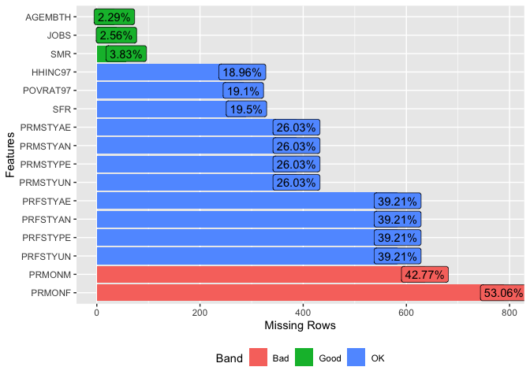

Dataset Preparation
================

-   [1. Introduction](#1-introduction)
    -   [1.1 Loading Packages](#11-loading-packages)
    -   [1.2 Importing the Data](#12-importing-the-data)
-   [2. Data Cleaning](#2-data-cleaning)
    -   [2.1 Viewing the Data](#21-viewing-the-data)
    -   [2.2 Duplicate Values](#22-duplicate-values)
    -   [2.3 Missing Values](#23-missing-values)
-   [3. Collapsing Dummy Variables](#3-collapsing-dummy-variables)
-   [4. Finalizing the Dataset](#4-finalizing-the-dataset)
    -   [4.1 Removing Variables](#41-removing-variables)
    -   [4.2 Verifying the Dataset](#42-verifying-the-dataset)
    -   [4.3 Refactoring Variables](#43-refactoring-variables)
    -   [4.4 Splitting the Dataset](#44-splitting-the-dataset)
    -   [4.5 Exporting the Dataset](#45-exporting-the-dataset)

## 1. Introduction

This section of the project will focus on preparing the dataset for
exploratory data analysis (EDA) and data modeling.

### 1.1 Loading Packages

``` r
# Load required libraries
library(DataExplorer)
library(tidyverse)
```

### 1.2 Importing the Data

``` r
# Import data
df <- read.csv("data/NLSY97_subset.csv")
```

## 2. Data Cleaning

### 2.1 Viewing the Data

I first looked at the structure of the dataset.

``` r
# Preview the data
head(df, 3)
```

    ##     ID EARNINGS  S      EXP FEMALE MALE BYEAR AGE AGEMBTH HHINC97 POVRAT97
    ## 1 4275    18.50 12 9.711538      0    1  1984  27      24   64000      402
    ## 2 4328    19.23 17 5.711538      0    1  1982  29      32    6000       38
    ## 3 8763    39.05 14 9.942307      0    1  1981  30      23   88252      555
    ##   HHBMBF HHBMOF HHOMBF HHBMONLY HHBFONLY HHOTHER MSA97NO MSA97NCC MSA97CC
    ## 1      1      0      0        0        0       0       0        0       1
    ## 2      1      0      0        0        0       0       0        0       0
    ## 3      0      0      0        1        0       0       0        1       0
    ##   MSA97NK ETHBLACK ETHHISP ETHWHITE EDUCPROF EDUCPHD EDUCMAST EDUCBA EDUCAA
    ## 1       0        0       0        1        0       0        0      0      0
    ## 2       1        0       0        1        0       0        0      1      0
    ## 3       0        0       0        1        0       0        0      0      0
    ##   EDUCHSD EDUCGED EDUCDO PRMONM PRMONF PRMSTYUN PRMSTYPE PRMSTYAN PRMSTYAE
    ## 1       1       0      0     14     14        0        0        0        1
    ## 2       0       0      0     12     12        0        0        0        1
    ## 3       1       0      0     NA     NA       NA       NA       NA       NA
    ##   PRFSTYUN PRFSTYPE PRFSTYAN PRFSTYAE SINGLE MARRIED COHABIT OTHSING FAITHN
    ## 1        0        0        0        1      0       1       0       0      0
    ## 2        0        0        0        1      0       1       0       0      0
    ## 3       NA       NA       NA       NA      0       0       1       0      0
    ##   FAITHP FAITHC FAITHJ FAITHO FAITHM   ASVABAR    ASVABWK    ASVABPC    ASVABMK
    ## 1      0      1      0      0      0 0.1240165 -0.6890168 -0.3050777 -0.2855563
    ## 2      1      0      0      0      0 0.4469109 -0.0981771 -0.3037769 -0.5482330
    ## 3      0      1      0      0      0 0.4177562  0.9479251  0.0596440  0.2939251
    ##      ASVABNO    ASVABCS     ASVABC    ASVABC4     VERBAL ASVABMV HEIGHT
    ## 1 -0.3558607 -0.7159587 -0.2054523 -0.3240111 -0.5305199   29818     70
    ## 2 -1.2057420 -0.1743928  0.1347132 -0.1414610 -0.2147450   46246     74
    ## 3  0.0612613 -0.0672739  0.5060075  0.4804706  0.5369214   66480     72
    ##   WEIGHT04 WEIGHT11 SF SM SFR SMR SIBLINGS REG97NE REG97NC REG97S REG97W
    ## 1      155      186 12 12  12  12        1       0       0      1      0
    ## 2      200      200 16 12  16  12        3       0       0      1      0
    ## 3      168      190 16  6  NA   6        1       0       0      0      1
    ##   RS97RURL RS97URBN RS97UNKN JOBS HOURS   TENURE CATGOV CATPRI CATNPO CATMIS
    ## 1        0        1        0    6    50 4.769231      0      1      0      0
    ## 2        0        1        0   NA    50 9.057693      0      0      0      1
    ## 3        0        1        0    3    65 4.980769      0      1      0      0
    ##   CATSE COLLBARG URBAN REGNE REGNC REGW REGS MSA11NO MSA11NCC MSA11CC MSA11NK
    ## 1     0        0     1     0     0    1    0       0        0       1       0
    ## 2     0        0     2     0     0    1    0       0        1       0       0
    ## 3     0        0     1     0     0    0    1       0        0       1       0
    ##   MSA11NIC
    ## 1        0
    ## 2        0
    ## 3        0

``` r
# View structure of the data
str(df)
```

    ## 'data.frame':    2000 obs. of  96 variables:
    ##  $ ID      : int  4275 4328 8763 8879 1994 2788 3473 268 1239 2333 ...
    ##  $ EARNINGS: num  18.5 19.2 39 16.8 36.1 ...
    ##  $ S       : int  12 17 14 18 15 12 13 14 14 17 ...
    ##  $ EXP     : num  9.71 5.71 9.94 1.54 2.94 ...
    ##  $ FEMALE  : int  0 0 0 0 0 0 0 0 0 0 ...
    ##  $ MALE    : int  1 1 1 1 1 1 1 1 1 1 ...
    ##  $ BYEAR   : int  1984 1982 1981 1983 1984 1983 1983 1981 1983 1981 ...
    ##  $ AGE     : int  27 29 30 28 27 28 28 30 28 30 ...
    ##  $ AGEMBTH : int  24 32 23 30 23 25 23 26 25 30 ...
    ##  $ HHINC97 : int  64000 6000 88252 NA 44188 97400 70751 71100 246474 61300 ...
    ##  $ POVRAT97: int  402 38 555 NA 278 612 445 380 1627 373 ...
    ##  $ HHBMBF  : int  1 1 0 1 1 1 1 0 1 1 ...
    ##  $ HHBMOF  : int  0 0 0 0 0 0 0 1 0 0 ...
    ##  $ HHOMBF  : int  0 0 0 0 0 0 0 0 0 0 ...
    ##  $ HHBMONLY: int  0 0 1 0 0 0 0 0 0 0 ...
    ##  $ HHBFONLY: int  0 0 0 0 0 0 0 0 0 0 ...
    ##  $ HHOTHER : int  0 0 0 0 0 0 0 0 0 0 ...
    ##  $ MSA97NO : int  0 0 0 0 0 0 0 0 0 0 ...
    ##  $ MSA97NCC: int  0 0 1 1 0 1 1 1 1 1 ...
    ##  $ MSA97CC : int  1 0 0 0 1 0 0 0 0 0 ...
    ##  $ MSA97NK : int  0 1 0 0 0 0 0 0 0 0 ...
    ##  $ ETHBLACK: int  0 0 0 0 0 0 0 0 0 0 ...
    ##  $ ETHHISP : int  0 0 0 0 0 0 0 1 0 0 ...
    ##  $ ETHWHITE: int  1 1 1 1 1 1 1 0 1 1 ...
    ##  $ EDUCPROF: int  0 0 0 0 0 0 0 0 0 0 ...
    ##  $ EDUCPHD : int  0 0 0 0 0 0 0 0 0 0 ...
    ##  $ EDUCMAST: int  0 0 0 1 0 0 0 0 0 1 ...
    ##  $ EDUCBA  : int  0 1 0 0 0 0 0 0 0 0 ...
    ##  $ EDUCAA  : int  0 0 0 0 0 0 0 1 0 0 ...
    ##  $ EDUCHSD : int  1 0 1 0 1 1 1 0 1 0 ...
    ##  $ EDUCGED : int  0 0 0 0 0 0 0 0 0 0 ...
    ##  $ EDUCDO  : int  0 0 0 0 0 0 0 0 0 0 ...
    ##  $ PRMONM  : int  14 12 NA 6 11 5 3 NA 10 NA ...
    ##  $ PRMONF  : int  14 12 NA 4 8 3 5 NA 6 NA ...
    ##  $ PRMSTYUN: int  0 0 NA 0 0 1 0 NA 1 NA ...
    ##  $ PRMSTYPE: int  0 0 NA 1 1 0 1 NA 0 NA ...
    ##  $ PRMSTYAN: int  0 0 NA 0 0 0 0 NA 0 NA ...
    ##  $ PRMSTYAE: int  1 1 NA 0 0 0 0 NA 0 NA ...
    ##  $ PRFSTYUN: int  0 0 NA 1 0 0 0 NA 1 NA ...
    ##  $ PRFSTYPE: int  0 0 NA 0 0 0 1 NA 0 NA ...
    ##  $ PRFSTYAN: int  0 0 NA 0 1 1 0 NA 0 NA ...
    ##  $ PRFSTYAE: int  1 1 NA 0 0 0 0 NA 0 NA ...
    ##  $ SINGLE  : int  0 0 0 0 1 0 1 0 0 0 ...
    ##  $ MARRIED : int  1 1 0 1 0 0 0 1 1 1 ...
    ##  $ COHABIT : int  0 0 1 0 0 1 0 0 0 0 ...
    ##  $ OTHSING : int  0 0 0 0 0 0 0 0 0 0 ...
    ##  $ FAITHN  : int  0 0 0 0 0 0 0 0 0 0 ...
    ##  $ FAITHP  : int  0 1 0 1 0 1 1 0 1 0 ...
    ##  $ FAITHC  : int  1 0 1 0 0 0 0 1 0 1 ...
    ##  $ FAITHJ  : int  0 0 0 0 1 0 0 0 0 0 ...
    ##  $ FAITHO  : int  0 0 0 0 0 0 0 0 0 0 ...
    ##  $ FAITHM  : int  0 0 0 0 0 0 0 0 0 0 ...
    ##  $ ASVABAR : num  0.124 0.447 0.418 0.714 1.543 ...
    ##  $ ASVABWK : num  -0.689 -0.0982 0.9479 -0.0594 0.3309 ...
    ##  $ ASVABPC : num  -0.3051 -0.3038 0.0596 -0.0329 0.7792 ...
    ##  $ ASVABMK : num  -0.2856 -0.5482 0.2939 -0.0595 1.1901 ...
    ##  $ ASVABNO : num  -0.3559 -1.2057 0.0613 1.6772 0.2165 ...
    ##  $ ASVABCS : num  -0.716 -0.1744 -0.0673 0.3248 0.2182 ...
    ##  $ ASVABC  : num  -0.205 0.135 0.506 0.366 1.153 ...
    ##  $ ASVABC4 : num  -0.324 -0.141 0.48 0.157 1.075 ...
    ##  $ VERBAL  : num  -0.5305 -0.2147 0.5369 -0.0496 0.5916 ...
    ##  $ ASVABMV : int  29818 46246 66480 51240 89773 86885 8396 36454 98479 72880 ...
    ##  $ HEIGHT  : int  70 74 72 73 71 66 69 70 71 71 ...
    ##  $ WEIGHT04: int  155 200 168 153 145 220 154 175 175 165 ...
    ##  $ WEIGHT11: int  186 200 190 175 170 245 150 185 180 170 ...
    ##  $ SF      : int  12 16 16 14 14 13 12 11 16 13 ...
    ##  $ SM      : int  12 12 6 14 16 13 16 11 20 14 ...
    ##  $ SFR     : int  12 16 NA 14 14 13 12 12 16 13 ...
    ##  $ SMR     : int  12 12 6 14 16 13 16 11 20 14 ...
    ##  $ SIBLINGS: int  1 3 1 2 1 1 1 3 1 1 ...
    ##  $ REG97NE : int  0 0 0 0 0 0 0 1 0 1 ...
    ##  $ REG97NC : int  0 0 0 1 0 1 0 0 1 0 ...
    ##  $ REG97S  : int  1 1 0 0 0 0 1 0 0 0 ...
    ##  $ REG97W  : int  0 0 1 0 1 0 0 0 0 0 ...
    ##  $ RS97RURL: int  0 0 0 1 0 1 0 0 0 0 ...
    ##  $ RS97URBN: int  1 1 1 0 1 0 1 1 1 1 ...
    ##  $ RS97UNKN: int  0 0 0 0 0 0 0 0 0 0 ...
    ##  $ JOBS    : int  6 NA 3 10 7 2 3 8 6 3 ...
    ##  $ HOURS   : int  50 50 65 40 40 50 30 43 40 40 ...
    ##  $ TENURE  : num  4.77 9.06 4.98 1.02 2.35 ...
    ##  $ CATGOV  : int  0 0 0 1 0 0 0 0 0 0 ...
    ##  $ CATPRI  : int  1 0 1 0 1 1 0 1 1 0 ...
    ##  $ CATNPO  : int  0 0 0 0 0 0 0 0 0 1 ...
    ##  $ CATMIS  : int  0 1 0 0 0 0 1 0 0 0 ...
    ##  $ CATSE   : int  0 0 0 0 0 0 0 0 0 0 ...
    ##  $ COLLBARG: int  0 0 0 1 0 0 0 0 0 0 ...
    ##  $ URBAN   : int  1 2 1 1 1 1 1 1 1 1 ...
    ##  $ REGNE   : int  0 0 0 0 0 0 0 1 0 1 ...
    ##  $ REGNC   : int  0 0 0 1 0 1 0 0 0 0 ...
    ##  $ REGW    : int  1 1 0 0 0 0 1 0 0 0 ...
    ##  $ REGS    : int  0 0 1 0 1 0 0 0 1 0 ...
    ##  $ MSA11NO : int  0 0 0 0 0 0 0 0 0 0 ...
    ##  $ MSA11NCC: int  0 1 0 1 0 0 1 0 0 1 ...
    ##  $ MSA11CC : int  1 0 1 0 1 1 0 1 1 0 ...
    ##  $ MSA11NK : int  0 0 0 0 0 0 0 0 0 0 ...
    ##  $ MSA11NIC: int  0 0 0 0 0 0 0 0 0 0 ...

The dataset contains 2000 rows and 96 variables. Although none of the
variable types are factors, there are many binary variables in the
dataset.

### 2.2 Duplicate Values

Next, I checked for duplicated values in the dataset and found that
there are 513 duplicate observations. I removed these rows from the
dataset.

``` r
# Check for duplicated IDs
dim(df[duplicated(df),])[1]
```

    ## [1] 513

``` r
# Remove duplicated rows
df <- df[!duplicated(df), ]
```

### 2.3 Missing Values

I used the *plot\_missing* function from the *DataExplorer* package to
visualize the missing values in the dataset.

``` r
# Plot the missing values
plot_missing(df, missing_only = TRUE)
```

<!-- -->

This plot shows the proportion of values missing for the variables that
have them. It also labels them as “good”, “ok”, and “bad” depending on
the number of missing values. Most of the variables in the plot are
**parental style in 1997**, **parental monitoring in 1997** and **family
background**. Other variables include birth year, number of jobs,
household income, and poverty rate in 1997.

``` r
# Count rows with no missing values
dim(df[complete.cases(df), ])
```

    ## [1] 492  96

There are only 492 observations without any missing values. For now, I
have decided to keep the variables with missing values. Once I finish
taking a closer look at these variables during the EDA section, I will
determine whether to drop them or use some kind imputation method.

## 3. Collapsing Dummy Variables

Many of the variables in the dataset are **dummy variables**. For
example, FEMALE and MALE are dummy variables for sex. If one of the
variables is coded as 1, the other one will be 0. Based the names of the
dummy variables (or the variable itself), I have classified them into 14
groups:

1.  **Sex**: FEMALE, MALE
2.  **Ethnicity**: ETHBLACK, ETHHISP, ETHWHITE
3.  **Education**: EDUCPROF, EDUCPHD, EDUCMAST, EDUCBA, EDUCAA, EDUCHSD,
    EDUCGED, EDUCDO
4.  **Marital Status**: SINGLE, MARRIED, COHABIT, OTHSING
5.  **Faith**: FAITHN, FAITHC, FAITHJ, FAITHP, FAITHO, FAITHM
6.  **Metropolitan Statistical Area in 1997**: MSA97NO, MSA97NCC,
    MSA97CC, MSA97NK
7.  **Rural/Urban Area in 1997**: RS97RURL, RS97URBN, RS97UNKN
8.  **Census Region in 1997**: REG97NE, REG97NC, REG97W, REG97S
9.  **Household Structure in 1997**: HHBMBF, HHBMOF, HHOMBF, HHBMONLY,
    HHBFONLY, HHOTHER
10. **Mother Parental Style in 1997**: PRMSTYUN, PRMSTYPE, PRMSTYAU,
    PRMSTYAU
11. **Paternal Parental Style in 1997**: PRFSTYUN, PRFSTYPE, PRFSTYAU,
    PRFSTYAE
12. **Category of Employment**: CATGOV, CATPRI, CATSE, CATNPO, CATMIS
13. **Metropolitan Statistical Area in 2011**: MSA11NO, MSA11NCC,
    MSA11CC, MSA11NK,
14. **Census Region in 2011**: REGNE, REGNC, REGW, REGS

For each group, I will collapse the dummy variables and create a single
variable to simplify the dataset. First, I will need to verify that the
dummy variables are mutually exclusive. To do this, I will calculate the
row sums of these variables and see if each sum is equal to 1. If the
summary statistics of the row sums are all equal to 1, then the
variables are mutually exclusive.

Once I verify that the dummy variables are mutually exclusive, I will
collapse them to create a single variable and verify that I recoded the
data correctly.

##### 1. Sex

``` r
# Obtain statistical summary of the row sums of the dummy variables
summary(rowSums(subset(df, select = c(FEMALE, MALE))))
```

    ##    Min. 1st Qu.  Median    Mean 3rd Qu.    Max. 
    ##       1       1       1       1       1       1

``` r
# Recode the dummy variables into a single variable
df$SEX <- as.factor(ifelse(df$FEMALE == 1, "Female", "Male"))

# Verify new variable
sample_n(subset(df, select = c(SEX, FEMALE, MALE)), 5)
```

    ##      SEX FEMALE MALE
    ## 1   Male      0    1
    ## 2   Male      0    1
    ## 3 Female      1    0
    ## 4   Male      0    1
    ## 5 Female      1    0

##### 2. Ethnicity

``` r
# Obtain statistical summary of the row sums of the dummy variables
summary(rowSums(subset(df, select = c(ETHBLACK, ETHHISP, ETHWHITE))))
```

    ##    Min. 1st Qu.  Median    Mean 3rd Qu.    Max. 
    ##       1       1       1       1       1       1

``` r
# Recode the dummy variables into a single variable
df$ETHNICITY <- as.factor(ifelse(df$ETHBLACK == 1, "Black",
                        ifelse(df$ETHHISP == 1, "Hispanic", "Non-black, non-hispanic")))

# Verify new variable
sample_n(subset(df, select = c(ETHNICITY, ETHBLACK, ETHHISP, ETHWHITE)), 5)
```

    ##                 ETHNICITY ETHBLACK ETHHISP ETHWHITE
    ## 1 Non-black, non-hispanic        0       0        1
    ## 2 Non-black, non-hispanic        0       0        1
    ## 3 Non-black, non-hispanic        0       0        1
    ## 4 Non-black, non-hispanic        0       0        1
    ## 5 Non-black, non-hispanic        0       0        1

##### 3. Education

``` r
# Obtain statistical summary of the row sums of the dummy variables
summary(rowSums(subset(df, select = c(EDUCPROF, EDUCPHD, EDUCMAST, EDUCBA, EDUCAA, EDUCHSD, EDUCGED, EDUCDO))))
```

    ##    Min. 1st Qu.  Median    Mean 3rd Qu.    Max. 
    ##       1       1       1       1       1       1

``` r
# Recode the dummy variables into a single variable
df$EDUCATION <- as.factor(ifelse(df$EDUCPROF == 1, "Professional degree",
                          ifelse(df$EDUCPHD == 1, "Doctorate",
                          ifelse(df$EDUCMAST == 1, "Master's degree",
                          ifelse(df$EDUCBA == 1, "Bachelor's degree",
                          ifelse(df$EDUCAA == 1, "Associate's degree",
                          ifelse(df$EDUCHSD == 1, "High school diploma",
                          ifelse(df$EDUCGED == 1, "GED", "High school drop-out"))))))))

# Verify new variable
sample_n(subset(df, select = c(EDUCATION, EDUCPROF, EDUCPHD, EDUCMAST, EDUCBA, EDUCAA, EDUCHSD, EDUCGED, EDUCDO)), 5)
```

    ##             EDUCATION EDUCPROF EDUCPHD EDUCMAST EDUCBA EDUCAA EDUCHSD EDUCGED
    ## 1 High school diploma        0       0        0      0      0       1       0
    ## 2   Bachelor's degree        0       0        0      1      0       0       0
    ## 3   Bachelor's degree        0       0        0      1      0       0       0
    ## 4 High school diploma        0       0        0      0      0       1       0
    ## 5     Master's degree        0       0        1      0      0       0       0
    ##   EDUCDO
    ## 1      0
    ## 2      0
    ## 3      0
    ## 4      0
    ## 5      0

##### 4. Marital Status

``` r
# Obtain statistical summary of the row sums of the dummy variables
summary(rowSums(subset(df, select = c(SINGLE, MARRIED, COHABIT, OTHSING))))
```

    ##    Min. 1st Qu.  Median    Mean 3rd Qu.    Max. 
    ##       1       1       1       1       1       1

``` r
# Recode the dummy variables into a single variable
df$MARITALSTAT <- as.factor(ifelse(df$SINGLE == 1, "Single, never married",
                            ifelse(df$MARRIED == 1, "Married, spouse present",
                            ifelse(df$COHABIT == 1, "Cohabiting", "Other single"))))

# Verify new variable
sample_n(subset(df, select = c(MARITALSTAT, SINGLE, MARRIED, COHABIT, OTHSING)), 5)
```

    ##               MARITALSTAT SINGLE MARRIED COHABIT OTHSING
    ## 1            Other single      0       0       0       1
    ## 2            Other single      0       0       0       1
    ## 3              Cohabiting      0       0       1       0
    ## 4            Other single      0       0       0       1
    ## 5 Married, spouse present      0       1       0       0

##### 5. Faith

``` r
# Obtain statistical summary of the row sums of the dummy variables
summary(rowSums(subset(df, select = c(FAITHN, FAITHC, FAITHJ, FAITHP, FAITHO, FAITHM))))
```

    ##    Min. 1st Qu.  Median    Mean 3rd Qu.    Max. 
    ##       1       1       1       1       1       1

``` r
# Recode the dummy variables into a single variable
df$FAITH <- as.factor(ifelse(df$FAITHN == 1, "None",
                      ifelse(df$FAITHC == 1, "Catholic",
                      ifelse(df$FAITHJ == 1, "Jewish",
                      ifelse(df$FAITHP == 1, "Protestant",
                      ifelse(df$FAITHO == 1, "Other", "Missing value"))))))

# Verify new variable
sample_n(subset(df, select = c(FAITH, FAITHN, FAITHC, FAITHJ, FAITHP, FAITHO, FAITHM)), 5)
```

    ##        FAITH FAITHN FAITHC FAITHJ FAITHP FAITHO FAITHM
    ## 1 Protestant      0      0      0      1      0      0
    ## 2 Protestant      0      0      0      1      0      0
    ## 3   Catholic      0      1      0      0      0      0
    ## 4 Protestant      0      0      0      1      0      0
    ## 5 Protestant      0      0      0      1      0      0

##### 6. Metropolitan Statistical Area in 1997

``` r
# Obtain statistical summary of the row sums of the dummy variables
summary(rowSums(subset(df, select = c(MSA97NO, MSA97NCC, MSA97CC, MSA97NK))))
```

    ##    Min. 1st Qu.  Median    Mean 3rd Qu.    Max. 
    ##       1       1       1       1       1       1

``` r
# Recode the dummy variables into a single variable
df$METSTAT97 <- as.factor(ifelse(df$MSA97NO == 1, "Not in MSA",
                      ifelse(df$MSA97NCC == 1, "MSA, not central city",
                      ifelse(df$MSA97CC == 1, "MSA, central city", "MSA, not known"))))

# Verify new variable
sample_n(subset(df, select = c(METSTAT97, MSA97NO, MSA97NCC, MSA97CC, MSA97NK)), 5)
```

    ##               METSTAT97 MSA97NO MSA97NCC MSA97CC MSA97NK
    ## 1 MSA, not central city       0        1       0       0
    ## 2            Not in MSA       1        0       0       0
    ## 3 MSA, not central city       0        1       0       0
    ## 4 MSA, not central city       0        1       0       0
    ## 5     MSA, central city       0        0       1       0

##### 7. Rural/Urban Area in 1997

``` r
# Obtain statistical summary of the row sums of the dummy variables
summary(rowSums(subset(df, select = c(RS97RURL, RS97URBN, RS97UNKN))))
```

    ##    Min. 1st Qu.  Median    Mean 3rd Qu.    Max. 
    ##       1       1       1       1       1       1

``` r
# Recode the dummy variables into a single variable
df$AREA97 <- as.factor(ifelse(df$RS97RURL == 1, "Rural",
                      ifelse(df$RS97URBN == 1, "Urban", "Unknown")))

# Verify new variable
sample_n(subset(df, select = c(AREA97, RS97RURL, RS97URBN, RS97UNKN)), 5)
```

    ##   AREA97 RS97RURL RS97URBN RS97UNKN
    ## 1  Rural        1        0        0
    ## 2  Urban        0        1        0
    ## 3  Urban        0        1        0
    ## 4  Urban        0        1        0
    ## 5  Urban        0        1        0

##### 8. Census Region in 1997

``` r
# Obtain statistical summary of the row sums of the dummy variables
summary(rowSums(subset(df, select = c(REG97NE, REG97NC, REG97W, REG97S))))
```

    ##    Min. 1st Qu.  Median    Mean 3rd Qu.    Max. 
    ##       1       1       1       1       1       1

``` r
# Recode the dummy variables into a single variable
df$CENREG97 <- as.factor(ifelse(df$REG97NE == 1, "North east",
                      ifelse(df$REG97NC == 1, "North central",
                      ifelse(df$REG97W == 1, "West", "South"))))

# Verify new variable
sample_n(subset(df, select = c(CENREG97, REG97NE, REG97NC, REG97W, REG97S)), 5)
```

    ##        CENREG97 REG97NE REG97NC REG97W REG97S
    ## 1    North east       1       0      0      0
    ## 2    North east       1       0      0      0
    ## 3         South       0       0      0      1
    ## 4          West       0       0      1      0
    ## 5 North central       0       1      0      0

##### 9. Household Structure in 1997

``` r
# Obtain statistical summary of the row sums of the dummy variables
summary(rowSums(subset(df, select = c(HHBMBF, HHBMOF, HHOMBF, HHBMONLY, HHBFONLY, HHOTHER))))
```

    ##    Min. 1st Qu.  Median    Mean 3rd Qu.    Max. 
    ##       1       1       1       1       1       1

``` r
# Recode the dummy variables into a single variable
df$HOUSE97 <- as.factor(ifelse(df$HHBMBF == 1, "Biological mother and father",
                        ifelse(df$HHBMOF == 1, "Biological mother, other father",
                        ifelse(df$HHOMBF == 1, "Other mother, biological father",
                        ifelse(df$HHBMONLY == 1, "Biological mother only",
                        ifelse(df$HHBFONLY == 1, "Biological father only", "Other"))))))

# Verify new variable
sample_n(subset(df, select = c(HOUSE97, HHBMBF, HHBMOF, HHOMBF, HHBMONLY, HHBFONLY, HHOTHER)), 5)
```

    ##                        HOUSE97 HHBMBF HHBMOF HHOMBF HHBMONLY HHBFONLY HHOTHER
    ## 1       Biological father only      0      0      0        0        1       0
    ## 2       Biological mother only      0      0      0        1        0       0
    ## 3 Biological mother and father      1      0      0        0        0       0
    ## 4       Biological mother only      0      0      0        1        0       0
    ## 5 Biological mother and father      1      0      0        0        0       0

##### 10. Maternal Parental Style in 1997

``` r
# Obtain statistical summary of the row sums of the dummy variables
summary(rowSums(subset(df, select = c(PRMSTYUN, PRMSTYPE, PRMSTYAN, PRMSTYAE))))
```

    ##    Min. 1st Qu.  Median    Mean 3rd Qu.    Max.    NA's 
    ##       1       1       1       1       1       1     387

``` r
# Recode the dummy variables into a single variable
df$MATSTYLE <- as.factor(ifelse(df$PRMSTYUN == 1, "Uninvolved",
                         ifelse(df$PRMSTYPE == 1, "Permissive",
                         ifelse(df$PRMSTYAN == 1, "Authoritarian", "Authoritative"))))

# Verify new variable
sample_n(subset(df, select = c(MATSTYLE, PRMSTYUN, PRMSTYPE, PRMSTYAN, PRMSTYAE)), 5)
```

    ##        MATSTYLE PRMSTYUN PRMSTYPE PRMSTYAN PRMSTYAE
    ## 1 Authoritative        0        0        0        1
    ## 2          <NA>       NA       NA       NA       NA
    ## 3          <NA>       NA       NA       NA       NA
    ## 4 Authoritative        0        0        0        1
    ## 5    Permissive        0        1        0        0

##### 11. Paternal Parental Style in 1997

``` r
# Obtain statistical summary of the row sums of the dummy variables
summary(rowSums(subset(df, select = c(PRFSTYUN, PRFSTYPE, PRFSTYAN, PRFSTYAE))))
```

    ##    Min. 1st Qu.  Median    Mean 3rd Qu.    Max.    NA's 
    ##       1       1       1       1       1       1     583

``` r
# Recode the dummy variables into a single variable
df$PATSTYLE <- as.factor(ifelse(df$PRFSTYUN == 1, "Uninvolved",
                         ifelse(df$PRFSTYPE == 1, "Permissive",
                         ifelse(df$PRFSTYAN == 1, "Authoritarian", "Authoritative"))))

# Verify new variable
sample_n(subset(df, select = c(PATSTYLE, PRFSTYUN, PRFSTYPE, PRFSTYAN, PRFSTYAE)), 5)
```

    ##        PATSTYLE PRFSTYUN PRFSTYPE PRFSTYAN PRFSTYAE
    ## 1    Uninvolved        1        0        0        0
    ## 2          <NA>       NA       NA       NA       NA
    ## 3 Authoritative        0        0        0        1
    ## 4    Permissive        0        1        0        0
    ## 5    Permissive        0        1        0        0

##### 12. Category of Employment

``` r
# Obtain statistical summary of the row sums of the dummy variables
summary(rowSums(subset(df, select = c(CATGOV, CATPRI, CATSE, CATNPO, CATMIS))))
```

    ##    Min. 1st Qu.  Median    Mean 3rd Qu.    Max. 
    ##   1.000   1.000   1.000   1.067   1.000   2.000

The maximum row sum is equal 2, indicating that these variables are not
mutually exclusive. I decided to take a closer look at these rows.

``` r
summary(subset(df[df$CATGOV + df$CATPRI + df$CATSE + df$CATNPO + df$CATMIS == 2, ], select = c(CATGOV, CATPRI, CATSE, CATNPO, CATMIS)))
```

    ##      CATGOV           CATPRI           CATSE       CATNPO      
    ##  Min.   :0.0000   Min.   :0.0000   Min.   :1   Min.   :0.0000  
    ##  1st Qu.:0.0000   1st Qu.:1.0000   1st Qu.:1   1st Qu.:0.0000  
    ##  Median :0.0000   Median :1.0000   Median :1   Median :0.0000  
    ##  Mean   :0.0404   Mean   :0.8384   Mean   :1   Mean   :0.0404  
    ##  3rd Qu.:0.0000   3rd Qu.:1.0000   3rd Qu.:1   3rd Qu.:0.0000  
    ##  Max.   :1.0000   Max.   :1.0000   Max.   :1   Max.   :1.0000  
    ##      CATMIS       
    ##  Min.   :0.00000  
    ##  1st Qu.:0.00000  
    ##  Median :0.00000  
    ##  Mean   :0.08081  
    ##  3rd Qu.:0.00000  
    ##  Max.   :1.00000

For the rows with a sum of 2, all the values for **CATSE**
(self-employment) are equal to 1, indicating that it is a separate
variable. I calculated the row sum summary again without **CATSE**.

``` r
# Subset group of variables and obtain summary of row sums
summary(rowSums(subset(df, select = c(CATGOV, CATPRI, CATNPO, CATMIS))))
```

    ##    Min. 1st Qu.  Median    Mean 3rd Qu.    Max. 
    ##       1       1       1       1       1       1

These set of variables are mutually exclusive, so I recoded them into
the Category of Employment variable. As for **CATSE**, it will remain a
separate variable for self-employment.

``` r
# Recode the dummy variables into a single variable
df$CATEMP <- as.factor(ifelse(df$CATGOV == 1, "Government",
                      ifelse(df$CATPRI == 1, "Private sector",
                      ifelse(df$CATNPO == 1, "Non-profit", "Missing value"))))

# Verify new variable
sample_n(subset(df, select = c(CATEMP, CATGOV, CATPRI, CATNPO, CATMIS)), 5)
```

    ##           CATEMP CATGOV CATPRI CATNPO CATMIS
    ## 1  Missing value      0      0      0      1
    ## 2 Private sector      0      1      0      0
    ## 3 Private sector      0      1      0      0
    ## 4 Private sector      0      1      0      0
    ## 5 Private sector      0      1      0      0

##### 13. Metropolitan Statistical Area in 2011

``` r
# Obtain statistical summary of the row sums of the dummy variables
summary(rowSums(subset(df, select = c(MSA11NO, MSA11NCC, MSA11CC, MSA11NK, MSA11NIC))))
```

    ##    Min. 1st Qu.  Median    Mean 3rd Qu.    Max. 
    ##       1       1       1       1       1       1

``` r
# Recode the dummy variables into a single variable
df$METSTAT11 <- as.factor(ifelse(df$MSA11NO == 1, "Not in MSA",
                      ifelse(df$MSA11NCC == 1, "MSA, not central city",
                      ifelse(df$MSA11CC == 1, "MSA, central city", 
                      ifelse(df$MSA11NIC == 1, "Not in country", "MSA, not known")))))

# Verify new variable
sample_n(subset(df, select = c(METSTAT11, MSA11NO, MSA11NCC, MSA11CC, MSA11NK, MSA11NIC)), 5)
```

    ##               METSTAT11 MSA11NO MSA11NCC MSA11CC MSA11NK MSA11NIC
    ## 1     MSA, central city       0        0       1       0        0
    ## 2 MSA, not central city       0        1       0       0        0
    ## 3 MSA, not central city       0        1       0       0        0
    ## 4     MSA, central city       0        0       1       0        0
    ## 5     MSA, central city       0        0       1       0        0

##### 14. Census Region in 2011

``` r
# Obtain statistical summary of the row sums of the dummy variables
summary(rowSums(subset(df, select = c(REGNE, REGNC, REGW, REGS))))
```

    ##    Min. 1st Qu.  Median    Mean 3rd Qu.    Max. 
    ##       1       1       1       1       1       1

``` r
# Recode the dummy variables into a single variable
df$CENREG11 <- as.factor(ifelse(df$REGNE == 1, "North east",
                      ifelse(df$REGNC == 1, "North central",
                      ifelse(df$REGW == 1, "West", "South"))))

# Verify new variable
sample_n(subset(df, select = c(CENREG11, REGNE, REGNC, REGW, REGS)), 5)
```

    ##        CENREG11 REGNE REGNC REGW REGS
    ## 1         South     0     0    0    1
    ## 2 North central     0     1    0    0
    ## 3         South     0     0    0    1
    ## 4          West     0     0    1    0
    ## 5 North central     0     1    0    0

## 4. Finalizing the Dataset

### 4.1 Removing Variables

Now that I have collapsed the dummy variables, I dropped their
respective columns from the dataset.

``` r
# Drop the dummy variables from the dataset
df <- subset(df, select = -c(FEMALE, MALE, ETHBLACK, ETHHISP, ETHWHITE, EDUCPROF,
                             EDUCPHD, EDUCMAST, EDUCBA, EDUCAA, EDUCHSD, EDUCGED, EDUCDO,
                             SINGLE, MARRIED, COHABIT, OTHSING, FAITHN, FAITHC, FAITHJ, 
                             FAITHP,FAITHO, FAITHM, MSA97NO, MSA97NCC, MSA97CC, MSA97NK,
                             RS97RURL, RS97URBN, RS97UNKN, REG97NE, REG97NC, REG97W,
                             REG97S, HHBMBF, HHBMOF, HHOMBF, HHBMONLY, HHBFONLY, HHOTHER,
                             PRMSTYUN, PRMSTYPE, PRMSTYAN, PRMSTYAE, PRFSTYUN, PRFSTYPE,
                             PRFSTYAN, PRFSTYAE, CATGOV, CATPRI, CATNPO, CATMIS, MSA11NO,
                             MSA11NCC, MSA11CC, MSA11NK, MSA11NIC, REGNE, REGNC, 
                             REGW,REGS))
```

### 4.2 Verifying the Dataset

I viewed the structure of the data again to see what else is required to
do.

``` r
str(df)
```

    ## 'data.frame':    1487 obs. of  49 variables:
    ##  $ ID         : int  4275 4328 8763 8879 1994 2788 3473 268 1239 2333 ...
    ##  $ EARNINGS   : num  18.5 19.2 39 16.8 36.1 ...
    ##  $ S          : int  12 17 14 18 15 12 13 14 14 17 ...
    ##  $ EXP        : num  9.71 5.71 9.94 1.54 2.94 ...
    ##  $ BYEAR      : int  1984 1982 1981 1983 1984 1983 1983 1981 1983 1981 ...
    ##  $ AGE        : int  27 29 30 28 27 28 28 30 28 30 ...
    ##  $ AGEMBTH    : int  24 32 23 30 23 25 23 26 25 30 ...
    ##  $ HHINC97    : int  64000 6000 88252 NA 44188 97400 70751 71100 246474 61300 ...
    ##  $ POVRAT97   : int  402 38 555 NA 278 612 445 380 1627 373 ...
    ##  $ PRMONM     : int  14 12 NA 6 11 5 3 NA 10 NA ...
    ##  $ PRMONF     : int  14 12 NA 4 8 3 5 NA 6 NA ...
    ##  $ ASVABAR    : num  0.124 0.447 0.418 0.714 1.543 ...
    ##  $ ASVABWK    : num  -0.689 -0.0982 0.9479 -0.0594 0.3309 ...
    ##  $ ASVABPC    : num  -0.3051 -0.3038 0.0596 -0.0329 0.7792 ...
    ##  $ ASVABMK    : num  -0.2856 -0.5482 0.2939 -0.0595 1.1901 ...
    ##  $ ASVABNO    : num  -0.3559 -1.2057 0.0613 1.6772 0.2165 ...
    ##  $ ASVABCS    : num  -0.716 -0.1744 -0.0673 0.3248 0.2182 ...
    ##  $ ASVABC     : num  -0.205 0.135 0.506 0.366 1.153 ...
    ##  $ ASVABC4    : num  -0.324 -0.141 0.48 0.157 1.075 ...
    ##  $ VERBAL     : num  -0.5305 -0.2147 0.5369 -0.0496 0.5916 ...
    ##  $ ASVABMV    : int  29818 46246 66480 51240 89773 86885 8396 36454 98479 72880 ...
    ##  $ HEIGHT     : int  70 74 72 73 71 66 69 70 71 71 ...
    ##  $ WEIGHT04   : int  155 200 168 153 145 220 154 175 175 165 ...
    ##  $ WEIGHT11   : int  186 200 190 175 170 245 150 185 180 170 ...
    ##  $ SF         : int  12 16 16 14 14 13 12 11 16 13 ...
    ##  $ SM         : int  12 12 6 14 16 13 16 11 20 14 ...
    ##  $ SFR        : int  12 16 NA 14 14 13 12 12 16 13 ...
    ##  $ SMR        : int  12 12 6 14 16 13 16 11 20 14 ...
    ##  $ SIBLINGS   : int  1 3 1 2 1 1 1 3 1 1 ...
    ##  $ JOBS       : int  6 NA 3 10 7 2 3 8 6 3 ...
    ##  $ HOURS      : int  50 50 65 40 40 50 30 43 40 40 ...
    ##  $ TENURE     : num  4.77 9.06 4.98 1.02 2.35 ...
    ##  $ CATSE      : int  0 0 0 0 0 0 0 0 0 0 ...
    ##  $ COLLBARG   : int  0 0 0 1 0 0 0 0 0 0 ...
    ##  $ URBAN      : int  1 2 1 1 1 1 1 1 1 1 ...
    ##  $ SEX        : Factor w/ 2 levels "Female","Male": 2 2 2 2 2 2 2 2 2 2 ...
    ##  $ ETHNICITY  : Factor w/ 3 levels "Black","Hispanic",..: 3 3 3 3 3 3 3 2 3 3 ...
    ##  $ EDUCATION  : Factor w/ 8 levels "Associate's degree",..: 5 2 5 7 5 5 5 1 5 7 ...
    ##  $ MARITALSTAT: Factor w/ 4 levels "Cohabiting","Married, spouse present",..: 2 2 1 2 4 1 4 2 2 2 ...
    ##  $ FAITH      : Factor w/ 6 levels "Catholic","Jewish",..: 1 6 1 6 2 6 6 1 6 1 ...
    ##  $ METSTAT97  : Factor w/ 4 levels "MSA, central city",..: 1 3 2 2 1 2 2 2 2 2 ...
    ##  $ AREA97     : Factor w/ 2 levels "Rural","Urban": 2 2 2 1 2 1 2 2 2 2 ...
    ##  $ CENREG97   : Factor w/ 4 levels "North central",..: 3 3 4 1 4 1 3 2 1 2 ...
    ##  $ HOUSE97    : Factor w/ 6 levels "Biological father only",..: 2 2 3 2 2 2 2 4 2 2 ...
    ##  $ MATSTYLE   : Factor w/ 4 levels "Authoritarian",..: 2 2 NA 3 3 4 3 NA 4 NA ...
    ##  $ PATSTYLE   : Factor w/ 4 levels "Authoritarian",..: 2 2 NA 4 1 1 3 NA 4 NA ...
    ##  $ CATEMP     : Factor w/ 4 levels "Government","Missing value",..: 4 2 4 1 4 4 2 4 4 3 ...
    ##  $ METSTAT11  : Factor w/ 4 levels "MSA, central city",..: 1 2 1 2 1 1 2 1 1 2 ...
    ##  $ CENREG11   : Factor w/ 4 levels "North central",..: 4 4 3 1 3 1 4 2 3 2 ...

### 4.3 Refactoring Variables

There are factor 3 variables left that are still coded as integers. I
decided to refactor those variables.

``` r
# Refactor self-employment variable
df$CATSE <- as.factor(ifelse(df$CATSE == 1, "Yes", "No"))

# Refactor collective bargaining variables
df$COLLBARG <- as.factor(ifelse(df$COLLBARG == 1, "Yes", "No"))

# Refactor urban (2011) variable 
df$AREA11 <- as.factor(ifelse(df$URBAN == 0, "Rural", ifelse(df$URBAN == 1, "Urban", "Unknown")))

# Drop the urban variable
df <- subset(df, select = -c(URBAN))
```

### 4.4 Splitting the Dataset

Since I will be creating models and validating them, I split the dataset
80-20 into a training and testing set.

``` r
# Set seed
set.seed(101)

# Obtain 80-20 split
train.obs <- sample(1:nrow(df), round(nrow(df) * .8), replace = FALSE)

# Split the dataset into a training and testing set
train <- df[train.obs, ]
test <- df[-train.obs, ]

# Verify the dimensions of the dataset
dim(train)
```

    ## [1] 1190   49

``` r
dim(test)
```

    ## [1] 297  49

### 4.5 Exporting the Dataset

Finally, I exported the data into two separate csv files to use in the
EDA and modeling sections.

``` r
# Export data into csv files
write.csv(train, "data/NLSY97_train.csv")
write.csv(test, "data/NLSY97_test.csv")
```
