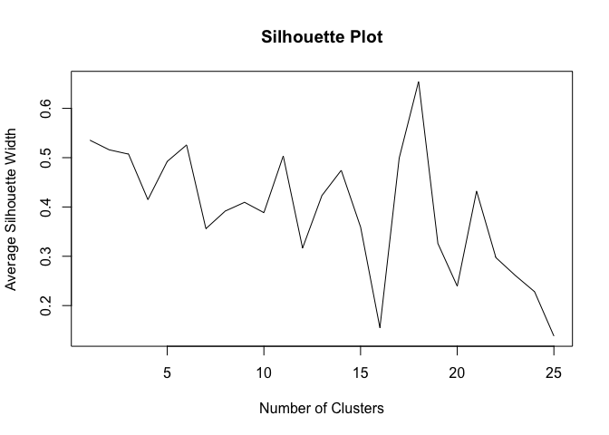

Feature Engineering Using a Clustering Algorithm
================

-   [1. Introduction](#1-introduction)
    -   [1.1 Loading Packages](#11-loading-packages)
    -   [1.2 Importing Data](#12-importing-data)
-   [2. Data Preparation](#2-data-preparation)
    -   [2.1 Removing Extraneous
        Variables](#21-removing-extraneous-variables)
    -   [2.2 Transforming and Recoding
        Variables](#22-transforming-and-recoding-variables)
    -   [2.3 Missing Values](#23-missing-values)
    -   [2.4 Functions](#24-functions)
-   [3. Clustering Algorithm](#3-clustering-algorithm)
    -   [3.1 Hierarchical Clustering, Gower Distance, & Silhouette
        Width](#31-hierarchical-clustering-gower-distance--silhouette-width)
    -   [3.2 Clustering Functions](#32-clustering-functions)
-   [4. Feature Engineering](#4-feature-engineering)
    -   [4.1 Work-Related Variables](#41-work-related-variables)
    -   [4.2 Demographics](#42-demographics)
    -   [4.3 Education](#43-education)
    -   [4.4 Household-Related
        Variables](#44-household-related-variables)
    -   [4.5 Location](#45-location)
    -   [4.6 Relationship With Hourly
        Wage](#46-relationship-with-hourly-wage)
-   [5. Models](#5-models)
    -   [5.1 Linear Regression](#51-linear-regression)
    -   [5.2 LASSO](#52-lasso)
    -   [5.3 Random Forest](#53-random-forest)
    -   [5.4 Generalized Boosting Model](#54-generalized-boosting-model)
    -   [5.5 Comparing Models](#55-comparing-models)
-   [6. Conclusion](#6-conclusion)

## 1. Introduction

The goal of this section is to perform **feature engineering** by
utilizing an **unsupervised learning** to see if it can improve the
performance of the previous models. I can achieve this by implementing
**hierarchical clustering** to group observations into similar clusters
based on a set of similar predictors and using the resulting cluster
labels as predictors in the model.

### 1.1 Loading Packages

These are the packages I used for this section of the project.

``` r
# Load required libraries
library(cluster)
library(stats)
library(fpc)
library(DataExplorer)
library(glmnet)
library(ggplot2)
library(ggthemes)
library(GGally)
library(randomForest)
library(gbm)
library(reshape2)
```

I set a seed to obtain reproducible results.

``` r
# Set seed for reproducible results
set.seed(101)
```

### 1.2 Importing Data

I imported both the training set and the testing set. Data in both sets
will be clustered to groups, but only the training set will be used to
build the models while the testing set will be used to measure
performance.

``` r
# Import data
train <- read.csv("data/NLSY97_train.csv")
test <- read.csv("data/NLSY97_test.csv")
```

## 2. Data Preparation

The same data cleaning and preparation that was done in the **Model
Analysis** section is done here.

### 2.1 Removing Extraneous Variables

``` r
# Remove extra columns from the training and testing set
train <- subset(train, select = -c(X, ID))
test <- subset(test, select = -c(X, ID))
```

### 2.2 Transforming and Recoding Variables

``` r
# Create new private sector variable
train$PRIV <- as.factor(ifelse(train$CATEMP == "Private sector", "Yes", "No"))
test$PRIV <- as.factor(ifelse(test$CATEMP == "Private sector", "Yes", "No"))

# Create new marital status variable
train$MARRIED <- as.factor(ifelse(train$MARITALSTAT == "Married, spouse present", "Yes", "No"))
test$MARRIED <- as.factor(ifelse(test$MARITALSTAT == "Married, spouse present", "Yes", "No"))

# Create new household structure variable
train$BIOPARENTS <- as.factor(ifelse(train$HOUSE97 == "Biological mother and father", "Yes", "No"))
test$BIOPARENTS <- as.factor(ifelse(test$HOUSE97 == "Biological mother and father", "Yes", "No"))

# Log transform household income
train$logHHINC97 <- log(train$HHINC97 + 1)
test$logHHINC97 <- log(test$HHINC97 + 1)

# Log transform hourly wage
train$logWAGE <- log(train$EARNINGS)
test$logWAGE <- log(test$EARNINGS)
```

### 2.3 Missing Values

``` r
# Drop variable with lots of missing values
train <- subset(train, select = -c(PRMONM, PRMONF, MATSTYLE, PATSTYLE, SFR, SMR))
test <- subset(test, select = -c(PRMONM, PRMONF, MATSTYLE, PATSTYLE, SFR, SMR))

# Drop rows with missing values
train <- train[complete.cases(train), ]
test <- test[complete.cases(test), ]

# Check the final dimensions of the training and testing sets
dim(train)
```

    ## [1] 912  47

``` r
dim(test)
```

    ## [1] 241  47

The finalized training set has 912 observations while the finalized
testing set has 241.

### 2.4 Functions

The same functions used in the **Model Analysis** section will also be
used here. For more information on these functions, you can refer to
that section of the project.

``` r
# Define function that will print the residual plot
plot.residuals <- function(y.est, model) {
  
  # Calculate residuals
  residuals <- train$logWAGE -  y.est
  
  # Create dataframe of predicted values and residuals
  df.resid <- data.frame(y.est, residuals)
  
  # Plot residual plot
  p <- ggplot(df.resid, aes(x = y.est, y = residuals)) + 
    geom_point() +
    xlab("Predicted log(Hourly Wage)") +
    ggtitle(model) +
    geom_smooth(method = 'lm') +
    theme_economist()
  
  p
}
```

``` r
# This functions calculate the RMSE for log(hourly wage)
rmse <- function(y.est, y) {
  return(sqrt(mean((y - y.est)^2)))
}
```

``` r
# This function uses the RMSE function to calculate the training and testing errors
get.errors <- function(model.fit, df.train, df.test, model) {
  
  # Calculate the error for log(WAGE)
  train.rmse.log <- rmse(predict(model.fit, df.train), train$logWAGE)
  test.rmse.log <- rmse(predict(model.fit, df.test), test$logWAGE)
  
  # Calculate the error for hourly wage
  train.rmse <- rmse(exp(predict(model.fit, df.train)), train$EARNINGS)
  test.rmse <- rmse(exp(predict(model.fit, df.test)), test$EARNINGS)
  
  # Create a dataframe to of the calculated errors
  df.mse <- data.frame(model, train.rmse.log, train.rmse, test.rmse.log, test.rmse)
  
  return(df.mse)
}
```

## 3. Clustering Algorithm

### 3.1 Hierarchical Clustering, Gower Distance, & Silhouette Width

**Hierarchical clustering** is a clustering method that works similar to
**k-means clustering**. It results in a tree-based representation of the
observations, which removes the need for specifying *k*, the number of
clusters.

Since the dataset contains categorical variables, the values of these
variables must be transformed in order to be comparable to the
quantitative variables. I can achieve this by calculating the **Gower
distance**, which measures the dissimilarity of the variables with mixed
data.

Finally, even though there is no need to specify *k* when performing
hierarchical clustering, I still need to select the optimal number of
clusters to obtain the cluster labels. These cluster labels will be used
as the values for the predictors when building the models. The
**silhouette** is a metric that measures how similar an object is to its
own cluster compared to other clusters. By calculating the **average
silhouette width** of the clusters, I can determine the optimal value of
*k* to use based on which *k* has the highest average silhouette width.

### 3.2 Clustering Functions

These next two functions will use hierarchical clustering to group
similar observations into clusters using the gower distance. The first
function determines the optimal number of clusters and groups the data
in the training set:

1.  Calculate the **gower distance** of the data.
2.  Use **hierarchical clustering** to group the data based on the gower
    distance values.
3.  Obtain attributes of the clusters including the number of clusters
    and the **average silhouette width**.
4.  Obtain the optimal number of clusters, *k*, based on the maximum
    silhouette width.
5.  Obtain cluster labels of the resulting cluster with the specified
    optimal number of clusters.

``` r
# This function performs clustering on the traning set and obtains the optimal k value
cluster.feature <- function(df) {
  
  # Calculate the gower distance
  gow.dist <- daisy(df, metric = c("gower"))
  
  # Use hierarchical clustering to obtain clusters
  cluster <- hclust(gow.dist, method = "complete")
  
  # Obtain clustering attributes with a maximum k = 25
  cluster.stats <- cluster.stats(d = gow.dist, clustering = cutree(cluster, k = 25))
  
  # View sillhouette plot to determine number of clusters
  plot(cluster.stats$clus.avg.silwidths,
       main = "Silhouette Plot",
       ylab = "Average Silhouette Width", 
       xlab = "Number of Clusters", type = "l")
  
  # Obtain optimal number of clusters 
  k.val <- (which.max(cluster.stats$clus.avg.silwidths))
  
  # Obtain clustering labels of the resulting clusters with the optimal number of clusters
  clusters <- cutree(cluster, k = k.val)
  
  # Return the cluster labels
  return(list(clusters, k.val))
}
```

The second function uses the obtained optimal number of clusters
obtained from the first function to group the data in the testing set:

1.  Calculate the **gower distance** of the data.
2.  Use **hierarchical clustering** to group the data based on the gower
    distance values.
3.  Obtain cluster labels of the resulting cluster with the specified
    optimal number of clusters.

``` r
# This function uses the optimal k-value to cluster the testing set
test.cluster.feature <- function(df, k.val) {
  
  # Calculate the gower distance
  gow.dist <- daisy(df, metric = c("gower"))
  
  # Use hierarchical clustering to obtain clusters
  cluster <- hclust(gow.dist, method = "complete")

  # Obtain clustering labels of the resulting clusters with the optimal number of clusters
  clusters <- cutree(cluster, k = k.val)
  
  # Return the cluster labels
  return(clusters)
}
```

## 4. Feature Engineering

I will now use the clustering algorithm I defined in the previous
section to group the data together. I will then use the resulting
cluster labels as predictors when creating my models. In the EDA
section, I divided the variables into 5 categories:

1.  Work
2.  Demographics
3.  Education
4.  Household
5.  Location

I will cluster the data based on each category and create a new
predictor that will represent the variables in that category.

### 4.1 Work-Related Variables

The work-related variables consists of 7 variables. I subset the data to
contain only these variables.

``` r
# Subset work-related variables on the training and testing sets
df.work <- subset(train, select = c(HOURS, TENURE, EXP, JOBS, PRIV, CATSE, COLLBARG))
df.work.test <- subset(test, select = c(HOURS, TENURE, EXP, JOBS, PRIV, CATSE, COLLBARG))
```

Next, I use the clustering function to cluster the data, view the
silhouette plot, and obtain the cluster labels with the optimal number
of clusters.

``` r
# Obtain clusters, silhouette plot, and optimal number of clusters
c.list <- cluster.feature(df.work)

# Extract clusters and number of clusters
work <- c.list[[1]]
k.val <- c.list[[2]]
```


Finally, I add these cluster labels to the training set as the new
variable **work** and use the second function to do the same for the
testing set.

``` r
# Add clusters to training set
train <- cbind(train, work)

# Obtain clusters for test set
work <- test.cluster.feature(df.work.test, k.val)

# Add clusters to test set
test <- cbind(test, work)
```

The histogram below shows the distribution of the new variable.

``` r
# View histogram of the new variable, work
ggplot(train, aes(x = work)) +
  geom_histogram(fill = "#163A5F", color = "black") +
  xlab("Work") + 
  ylab("Count") +
  ggtitle("Histogram of Work") +
  theme_economist() +
  theme(axis.text=element_text(size=12), axis.title=element_text(size=12))
```


### 4.2 Demographics

There are 8 variables related to demographics, which will be used to
create the new variable **demographics**.

``` r
# Subset demographic variables on the training and testing sets
df.dem <- subset(train, select = c(SEX, ETHNICITY, AGE, HEIGHT, WEIGHT04, WEIGHT11, MARRIED, FAITH))
df.dem.test <- subset(test, select = c(SEX, ETHNICITY, AGE, HEIGHT, WEIGHT04, WEIGHT11, MARRIED, FAITH))
```

``` r
# Calculate gower distance
c.list <- cluster.feature(df.dem)

# Extract clusters and number of clusters
demographics <- c.list[[1]]
k.val <- c.list[[2]]

# Add clusters to training set
train <- cbind(train, demographics)

# Obtain clusters for test set
demographics <- test.cluster.feature(df.dem.test, k.val)

# Add clusters to test set
test <- cbind(test, demographics)
```



The histogram below shows the distribution of the new variable.

``` r
# View histogram of the new variable, demographics
ggplot(train, aes(x = demographics)) +
  geom_histogram(fill = "#163A5F", color = "black") +
  xlab("Work") + 
  ylab("Count") +
  ggtitle("Histogram of Demographics") +
  theme_economist() +
  theme(axis.text=element_text(size=12), axis.title=element_text(size=12))
```


### 4.3 Education

There are 7 variables related to education, which will be used to create
the new variable **education**.

``` r
# Subset education variables on the training and testing sets
df.edu <- subset(train, select = c(S, ASVABAR, ASVABWK, ASVABPC, ASVABNO, ASVABCS, ASVABMK))
df.edu.test <- subset(test, select = c(S, ASVABAR, ASVABWK, ASVABPC, ASVABNO, ASVABCS, ASVABMK))
```

``` r
# Calculate gower distance
c.list <- cluster.feature(df.edu)

# Extract clusters and number of clusters
education <- c.list[[1]]
k.val <- c.list[[2]]

# Add clusters to training set
train <- cbind(train, education)

# Obtain clusters for test set
education <- test.cluster.feature(df.edu.test, k.val)

# Add clusters to test set
test <- cbind(test, education)
```


The histogram below shows the distribution of the new variable.

``` r
# View histogram of the new variable, education
ggplot(train, aes(x = education)) +
  geom_histogram(fill = "#163A5F", color = "black") +
  xlab("Work") + 
  ylab("Count") +
  ggtitle("Histogram of Education") +
  theme_economist() +
  theme(axis.text=element_text(size=12), axis.title=element_text(size=12))
```


### 4.4 Household-Related Variables

The household-related variables consist of 6 variables, which will be
used to create the new variable **household**.

``` r
# Subset household variables on the training and testing sets
df.house <- subset(train, select = c(SM, SF, SIBLINGS, AGEMBTH, HHINC97, POVRAT97))
df.house.test <- subset(test, select = c(SM, SF, SIBLINGS, AGEMBTH, HHINC97, POVRAT97))
```

``` r
# Calculate gower distance
c.list <- cluster.feature(df.house)

# Extract clusters and number of clusters
household <- c.list[[1]]
k.val <- c.list[[2]]

# Add clusters to training set
train <- cbind(train, household)

# Obtain clusters for test set
household <- test.cluster.feature(df.house.test, k.val)

# Add clusters to test set
test <- cbind(test, household)
```


The histogram below shows the distribution of the new variable.

``` r
# View histogram of the new variable, household
ggplot(train, aes(x = household)) +
  geom_histogram(fill = "#163A5F", color = "black") +
  xlab("Work") + 
  ylab("Count") +
  ggtitle("Histogram of Household") +
  theme_economist() +
  theme(axis.text=element_text(size=12), axis.title=element_text(size=12))
```


### 4.5 Location

There are 6 variables related to location, which will be used to create
the new variable **location**.

``` r
# Subset location variables on the training and testing sets
df.loc <- subset(train, select = c(METSTAT97, METSTAT11, CENREG97, CENREG11, AREA97, AREA11))
df.loc.test <- subset(test, select = c(METSTAT97, METSTAT11, CENREG97, CENREG11, AREA97, AREA11))
```

``` r
# Calculate gower distance
c.list <- cluster.feature(df.loc)

# Extract clusters and number of clusters
location <- c.list[[1]]
k.val <- c.list[[2]]

# Add clusters to training set
train <- cbind(train, location)

# Obtain clusters for test set
location <- test.cluster.feature(df.loc.test, k.val)

# Add clusters to test set
test <- cbind(test, location)
```


The histogram below shows the distribution of the new variable.

``` r
# View histogram of the new variable, location
ggplot(train, aes(x = location)) +
  geom_histogram(fill = "#163A5F", color = "black") +
  xlab("Work") + 
  ylab("Count") +
  ggtitle("Histogram of Location") +
  theme_economist() +
  theme(axis.text=element_text(size=12), axis.title=element_text(size=12))
```


### 4.6 Relationship With Hourly Wage

Next, I plotted the scatterplot matrix of these new variables to see
their relationship with **logWAGE**.

``` r
# Plot a scatterplot matrix of the new features and logWAGE
ggpairs(train, columns = c("work", "demographics", "education", "household", "location", "logWAGE")) + theme_bw()
```

<!-- -->

There does not appear to be any linear relationships between these new
variables and **logWAGE**.

## 5. Models

Now that I have my 5 new predictors, I can fit a model on the data. I
will be using the same models I used in the **Model Analysis** section
with the exception of the dimension reduction methods.

### 5.1 Linear Regression

The first model I will be fitting is the linear regression model.

``` r
# Fit a linear regression model
lm.clust.fit <- lm(logWAGE ~ work + demographics + education + household + location, data = train)

# Summary of model          
summary(lm.clust.fit)
```

    ## 
    ## Call:
    ## lm(formula = logWAGE ~ work + demographics + education + household + 
    ##     location, data = train)
    ## 
    ## Residuals:
    ##      Min       1Q   Median       3Q      Max 
    ## -2.19401 -0.32272 -0.01372  0.32114  1.98953 
    ## 
    ## Coefficients:
    ##               Estimate Std. Error t value Pr(>|t|)    
    ## (Intercept)   3.052003   0.066858  45.649  < 2e-16 ***
    ## work         -0.002037   0.003288  -0.619   0.5358    
    ## demographics  0.005066   0.003834   1.321   0.1868    
    ## education    -0.022440   0.003911  -5.738 1.31e-08 ***
    ## household     0.012419   0.006261   1.984   0.0476 *  
    ## location     -0.038569   0.007324  -5.266 1.74e-07 ***
    ## ---
    ## Signif. codes:  0 '***' 0.001 '**' 0.01 '*' 0.05 '.' 0.1 ' ' 1
    ## 
    ## Residual standard error: 0.5396 on 906 degrees of freedom
    ## Multiple R-squared:  0.07246,    Adjusted R-squared:  0.06734 
    ## F-statistic: 14.15 on 5 and 906 DF,  p-value: 2.36e-13

The variables **demographics** and **household** have positive
coefficients while **work**, **education**, and **location** have
negative coefficients. However, the meaning of these values are not
straightforward since they resulted from the clustering algorithm. The
coefficients for **education**, **household**, and **location** are
statistically significant in the model.

``` r
# Plot residuals of the linear regression model
plot.residuals(predict(lm.clust.fit), "Residual Plot")
```


The residuals appear to be randomly distributed with a mean of 0, which
indicates a reasonable fit.

### 5.2 LASSO

The next model I will fit is the LASSO model.

``` r
# Obtain model matrix of the training set
x <- model.matrix(logWAGE ~ work + demographics + education + household + location, train)[,-1]

# Obtain model matrix of the testing set
x.test <- model.matrix(logWAGE ~ work + demographics + education + household + location, test)[,-1]

# Obtain y observations of the training set
y.train <- train$logWAGE

# Estimate lambda using cross-validation
lasso.cv <- cv.glmnet(x, y.train, alpha = 1)

# Obtain minimum lambda value
lambda.cv <- lasso.cv$lambda.min
lambda.cv
```

    ## [1] 0.002594827

``` r
# Fit a LASSO model
lasso.clust.fit<- glmnet(x, y.train, alpha = 1, lambda = lambda.cv)

# Obtain LASSO model coefficients
coef(lasso.clust.fit)
```

    ## 6 x 1 sparse Matrix of class "dgCMatrix"
    ##                        s0
    ## (Intercept)   3.047016855
    ## work         -0.001562072
    ## demographics  0.004451395
    ## education    -0.021852945
    ## household     0.011606179
    ## location     -0.037614268

The results of the LASSO model are mostly the same as the results of the
linear regression model with slightly different coefficients.

``` r
# Plot residuals of the LASSO model
plot.residuals(predict(lasso.clust.fit, newx = x), "Residual Plot")
```


The residuals are also randomly distributed with a mean of 0, indicating
a reasonable fit.

### 5.3 Random Forest

Next, I fit a random forest model with the default number of trees and
plotted the calculated training errors to determine a reasonable number
of trees.

``` r
# Set seed
set.seed(101)

# Fit random forest model with 500 trees
rf.clust.fit<- randomForest(logWAGE ~ work + demographics + education + household + location, data = train)

# Plot the training MSE error to determine the optimal number of trees
plot(1:500, rf.clust.fit$mse, col = "red", type = "l", xlab = "Number of Trees", ylab = "Training MSE")
```

<!-- -->

Based on the MSE plot, a reasonable number of trees is around 150 as the
training MSE does not decrease by much as the number of trees continues
to grow.

``` r
# Set seed
set.seed(101)

# Fit random forest model with 150 trees
rf.clust.fit <- randomForest(logWAGE ~ work + demographics + education + household + location, data = train, ntree = 150)

# View summary of the random forest model
print(rf.clust.fit)
```

    ## 
    ## Call:
    ##  randomForest(formula = logWAGE ~ work + demographics + education +      household + location, data = train, ntree = 150) 
    ##                Type of random forest: regression
    ##                      Number of trees: 150
    ## No. of variables tried at each split: 1
    ## 
    ##           Mean of squared residuals: 0.2722866
    ##                     % Var explained: 12.68

The resulting model has a mean of squared residuals of 0.27. The percent
of variance explained by the predictors is 12.68%.

### 5.4 Generalized Boosting Model

The final model I used is a boosting model with a hundred trees and an
*interaction.depth* of 2.

``` r
# Set seed
set.seed(101)

# Fit a boosting model with 100 trees and an interaction depth of 2
gb.fit <- gbm(logWAGE ~ work + demographics + education + household + location, data = train, distribution = "gaussian", interaction.depth = 2)

# View summary of the boosting model
summary(gb.fit)
```

    ##                       var  rel.inf
    ## work                 work 34.73364
    ## education       education 24.78220
    ## location         location 14.50524
    ## demographics demographics 13.05773
    ## household       household 12.92119


Work and education are the most important features in predicting hourly
wage for this model.

### 5.5 Comparing Models

I calculated the training and testing errors and displayed them in a
table below.

``` r
# Calculate the RMSE of the boosting model for logWAGE
train.rmse.log <- rmse(predict(gb.fit, train, n.trees = 100), train$logWAGE)
test.rmse.log <- rmse(predict(gb.fit, test, n.trees = 100), test$logWAGE)

# Calculate the RMSE of the boosting model for EARNINGS
train.rmse <- rmse(exp(predict(gb.fit, train, n.trees = 100)), train$EARNINGS)
test.rmse <- rmse(exp(predict(gb.fit, test, n.trees = 100)), test$EARNINGS)

# Create a dataframe of the RMSE values for the boosting models
df.gb <- data.frame("Boosting", train.rmse.log, train.rmse, test.rmse.log, test.rmse)
colnames(df.gb) <- c("model", "train.rmse.log", "train.rmse", "test.rmse.log", "test.rmse")
```

``` r
# Obtain training and testing errors of the models.
rmse.df <- rbind(get.errors(lm.clust.fit, train, test, "Linear Regression"),
                 get.errors(lasso.clust.fit, x, x.test, "LASSO"),
                 get.errors(rf.clust.fit, train, test, "Random Forest"),
                 df.gb)

# View the table of RMSE values of all models
rmse.df
```

    ##               model train.rmse.log train.rmse test.rmse.log test.rmse
    ## 1 Linear Regression      0.5378038  11.843929     0.5869216  12.48552
    ## 2             LASSO      0.5378347  11.847947     0.5856997  12.47985
    ## 3     Random Forest      0.3629694   9.047689     0.6011095  12.59641
    ## 4          Boosting      0.4798159  10.891271     0.6230547  12.90683

The range of the training errors for **logWAGE** is 0.36 to 0.54 while
the range of the training errors for **EARNINGS** is 9.05 to 11.84.The
ranges of the testing errors are much smaller, which are 0.59 to 0.62 or
12.48 to 12.69.

These errors are higher than the errors of the initial models in the
**Model Analysis** section.

``` r
# Expand dataframe to a long format
metrics.long <- melt(rmse.df, id.vars = "model", variable.name = "error")

# Subset metrics for hourly wage
metrics.long.reg <- subset(metrics.long, error == 'train.rmse' | error == "test.rmse")

# Subset metrics for log(hourly wage)
metrics.long.log <- subset(metrics.long, error == 'train.rmse.log' | error == "test.rmse.log")
```

``` r
# Plot metrics for hourly wage
ggplot(metrics.long.reg, aes(model, value, group = error)) +
  geom_point(aes(color = error), size = 3) + 
  geom_line(aes(color = error), size = 1) + 
  scale_color_manual(values = c("#21ABA5", "#163A5F")) +
  ylim(8, 14) +
  ylab("Dollars") +
  ggtitle("Model Performance for Hourly Wage") +
  theme_economist() +
  theme(axis.text.x = element_text(angle = 15, vjust = 0.5),
        axis.title.x = element_blank())
```

<!-- -->

As expected, the testing errors are higher than the training errors. The
testing errors are generally the same for all the models, while the
training errors are lower for the random forest and boosting models.

The linear regression and LASSO models had the lowest testing errors
while the random forest and boosting models had the highest testing
errors.

## 6. Conclusion

Overall, utilizing hierarchical clustering for feature engineering
resulted in a worse performance across all models. Standard dimension
reduction methods such as principal component analysis regression or
partial least squares regression performed better than these models. A
larger dataset, a different clustering method, and a different criterion
for selecting the number of clusters could potentially improve the
performance of these models.

Despite the inferior performance of these models, it might be useful to
investigate this methodology of feature engineering in the future.
Depending on what method is used for feature engineering, the new
predictors could potentially be more interpretable and useful for
predicting hourly wage.
