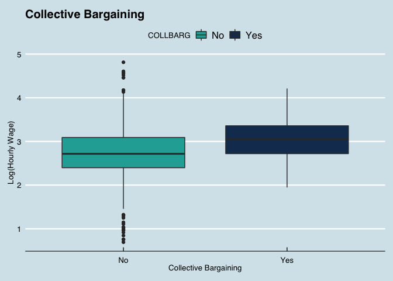
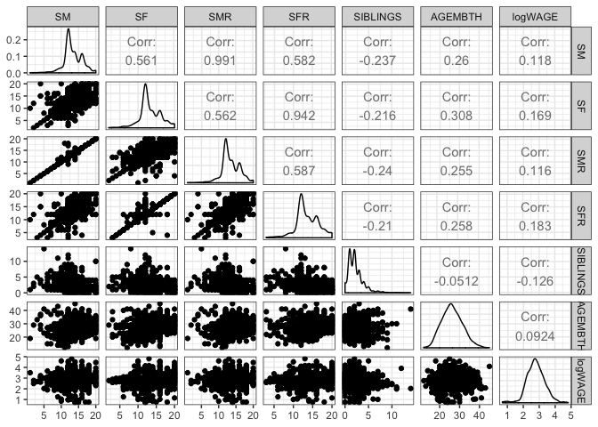

Exploratory Data Analysis
================

-   [1. Introduction](#1-introduction)
    -   [1.1 Loading Packages](#11-loading-packages)
    -   [1.2 Importing the Data](#12-importing-the-data)
    -   [1.3 Verifying the Dataset](#13-verifying-the-dataset)
    -   [1.4 Defining Variables](#14-defining-variables)
-   [2. Work-Related Variables](#2-work-related-variables)
    -   [2.1 Hourly Wage](#21-hourly-wage)
    -   [2.2 Weekly Hours, Tenure, Experience, and Number of
        Jobs](#22-weekly-hours-tenure-experience-and-number-of-jobs)
    -   [2.3 Category of Employment](#23-category-of-employment)
    -   [2.4 Collective Bargaining](#24-collective-bargaining)
-   [3. Demographics](#3-demographics)
    -   [3.1 Age, Height, and Weight](#31-age-height-and-weight)
    -   [3.2 Sex, Ethnicity, Marital Status, and
        Faith](#32-sex-ethnicity-marital-status-and-faith)
-   [4. Education](#4-education)
    -   [4.1 Schooling & Highest Educational
        Qualification](#41-schooling--highest-educational-qualification)
    -   [4.2 ASVAB Test Scores](#42-asvab-test-scores)
-   [5. Household-Related Variables](#5-household-related-variables)
    -   [5.1 Family Background](#51-family-background)
    -   [5.2 Household Income and Poverty Rate in
        1997](#52-household-income-and-poverty-rate-in-1997)
    -   [5.3 Household Parental Structure in
        1997](#53-household-parental-structure-in-1997)
-   [6. Location](#6-location)
    -   [6.1 Metropolitan Statistical
        Area](#61-metropolitan-statistical-area)
    -   [6.2 Census Region](#62-census-region)
    -   [6.3 Urban/Rural Area](#63-urbanrural-area)
-   [7. Conclusion](#7-conclusion)

## 1. Introduction

This section will focus on exploring the NLSY dataset of 1997. I will
visualize the variables and their relationships to determine whether or
not to include them in the model. Specifically, I will be looking for
variables that have a linear relationship with the target variable,
hourly wage, and transform them if necessary.

I divided the variables into different categories such as demographics,
location, etc. for organization purposes.

### 1.1 Loading Packages

``` r
# Load required libraries
library(ggplot2)
library(GGally)
library(ggthemes)
library(RColorBrewer)
library(stats)
```

### 1.2 Importing the Data

I will be using the **training set** for exploratory data analysis while
the **testing set** will be reserved for model testing.

``` r
# Import data
train <- read.csv("data/NLSY97_train.csv")
```

### 1.3 Verifying the Dataset

I viewed the structure of the training set to double check that the data
cleaning done on the previous section was kept.

``` r
# View structure of the dataset
str(train)
```

    ## 'data.frame':    1190 obs. of  50 variables:
    ##  $ X          : int  825 1912 95 1421 1938 1716 956 315 1496 867 ...
    ##  $ ID         : int  6375 2107 1797 5151 1858 2732 3939 2894 1123 4966 ...
    ##  $ EARNINGS   : num  15 13.9 18.2 13.5 86.5 ...
    ##  $ S          : int  18 16 16 17 18 17 20 20 17 12 ...
    ##  $ EXP        : num  3.44 6.69 4.83 2.69 5.48 ...
    ##  $ BYEAR      : int  1983 1982 1983 1984 1981 1983 1982 1980 1984 1984 ...
    ##  $ AGE        : int  28 29 28 27 30 28 29 31 27 27 ...
    ##  $ AGEMBTH    : int  25 17 32 25 28 28 25 32 33 32 ...
    ##  $ HHINC97    : int  NA 15100 NA NA 162500 67820 NA 44000 58500 46750 ...
    ##  $ POVRAT97   : int  NA 119 NA NA 649 412 NA 268 368 294 ...
    ##  $ PRMONM     : int  10 15 14 14 NA 12 10 NA 11 12 ...
    ##  $ PRMONF     : int  10 NA 11 13 NA 10 NA NA 11 NA ...
    ##  $ ASVABAR    : num  1.745 0.382 0.735 -0.527 1.72 ...
    ##  $ ASVABWK    : num  0.134 -0.318 -0.446 -0.826 2.232 ...
    ##  $ ASVABPC    : num  1.84 0.571 -0.468 -1.32 1.025 ...
    ##  $ ASVABMK    : num  0.843 0.605 0.112 -0.315 1.967 ...
    ##  $ ASVABNO    : num  1.939 1.189 -0.757 0.219 0.222 ...
    ##  $ ASVABCS    : num  1.9038 -0.679 -0.0315 -0.2737 1.3521 ...
    ##  $ ASVABC     : num  1.501 0.279 0.152 -0.88 1.84 ...
    ##  $ ASVABC4    : num  1.2759 0.3465 -0.0193 -0.8368 1.9424 ...
    ##  $ VERBAL     : num  1.052 0.135 -0.488 -1.145 1.736 ...
    ##  $ ASVABMV    : int  90076 61498 44904 21243 98740 70407 93719 93976 70116 33532 ...
    ##  $ HEIGHT     : int  66 61 76 65 66 70 67 63 62 64 ...
    ##  $ WEIGHT04   : int  130 140 185 140 125 180 175 110 120 130 ...
    ##  $ WEIGHT11   : int  135 198 220 160 145 200 162 121 125 144 ...
    ##  $ SF         : int  13 12 14 14 20 14 16 20 13 9 ...
    ##  $ SM         : int  13 13 14 12 20 14 16 16 12 12 ...
    ##  $ SFR        : int  13 NA 14 14 20 14 NA NA 13 9 ...
    ##  $ SMR        : int  13 13 14 12 20 14 16 16 12 12 ...
    ##  $ SIBLINGS   : int  2 2 2 1 2 1 0 2 1 2 ...
    ##  $ JOBS       : int  12 9 2 4 3 3 16 4 5 6 ...
    ##  $ HOURS      : int  30 60 40 40 60 50 40 20 32 40 ...
    ##  $ TENURE     : num  0.308 5.308 5.173 2.038 5.192 ...
    ##  $ CATSE      : Factor w/ 2 levels "No","Yes": 1 1 1 1 1 1 1 1 1 1 ...
    ##  $ COLLBARG   : Factor w/ 2 levels "No","Yes": 1 1 1 2 1 1 1 2 2 2 ...
    ##  $ SEX        : Factor w/ 2 levels "Female","Male": 1 1 2 1 1 2 1 1 1 1 ...
    ##  $ ETHNICITY  : Factor w/ 3 levels "Black","Hispanic",..: 3 1 3 3 3 3 3 3 3 3 ...
    ##  $ EDUCATION  : Factor w/ 8 levels "Associate's degree",..: 2 2 2 2 8 2 7 3 2 5 ...
    ##  $ MARITALSTAT: Factor w/ 4 levels "Cohabiting","Married, spouse present",..: 2 2 2 2 1 2 1 2 1 3 ...
    ##  $ FAITH      : Factor w/ 6 levels "Catholic","Jewish",..: 6 6 6 3 6 1 6 4 1 1 ...
    ##  $ METSTAT97  : Factor w/ 4 levels "MSA, central city",..: 4 2 2 4 2 2 1 2 2 4 ...
    ##  $ AREA97     : Factor w/ 2 levels "Rural","Urban": 2 2 1 2 2 1 2 2 2 1 ...
    ##  $ CENREG97   : Factor w/ 4 levels "North central",..: 4 2 1 1 1 1 3 1 2 2 ...
    ##  $ HOUSE97    : Factor w/ 6 levels "Biological father only",..: 2 3 2 2 2 2 3 3 2 2 ...
    ##  $ MATSTYLE   : Factor w/ 4 levels "Authoritarian",..: 3 2 3 2 NA 2 3 3 1 3 ...
    ##  $ PATSTYLE   : Factor w/ 4 levels "Authoritarian",..: 3 NA 2 2 NA 2 NA NA 3 NA ...
    ##  $ CATEMP     : Factor w/ 4 levels "Government","Missing value",..: 4 3 4 2 4 4 1 1 4 1 ...
    ##  $ METSTAT11  : Factor w/ 4 levels "MSA, central city",..: 4 1 2 1 1 2 2 1 1 2 ...
    ##  $ CENREG11   : Factor w/ 4 levels "North central",..: 3 4 1 1 2 1 4 2 2 2 ...
    ##  $ AREA11     : Factor w/ 3 levels "Rural","Unknown",..: 3 3 1 3 3 3 3 3 3 3 ...

There are 2 variables, **ID** and **X**, that will not be used for this
project.

### 1.4 Defining Variables

I defined 2 vectors of color hex codes to be used for the
visualizations.

``` r
# Hex codes for factor variables
colors.f <- c("#334257", "#476072", "#548CA8", "#11324D", "#001E6C", "#035397")

# Hex codes for binary variables
colors.b <- c("#21ABA5", "#163A5F")
```

## 2. Work-Related Variables

The first set of variables I will be exploring are the work-related
variables. It also contains the target variable, **EARNINGS**, which is
the hourly wage of the NLSY97 participants. All of these variables are
as of the 2011 interview.

**List of Variables**:

1.  **HOURS** - usual number of hours worked per week
2.  **TENURE** - years with current employer
3.  **EXP** - total out-of-school work experience (years)
4.  **JOBS** - number of jobs
5.  **CATEMP** - category of employment
6.  **CATSE** - self-employment
7.  **COLLBARG** - pay set by collective bargaining

### 2.1 Hourly Wage

I looked at the summary statistics of hourly wage and plotted its
distribution.

``` r
# View summary statistics of hourly wage
summary(train$EARNINGS)
```

    ##    Min. 1st Qu.  Median    Mean 3rd Qu.    Max. 
    ##    2.00   11.44   15.81   18.94   22.87  123.08

``` r
# View standard deviation of hourly wage
sd(train$EARNINGS)
```

    ## [1] 12.01771

``` r
# Histogram of hourly wage
ggplot(train, aes(x = EARNINGS)) +
  geom_histogram(fill = "#163A5F", color = "black") +
  xlab("Hourly Wage (dollars/hr)") + 
  ylab("Count") +
  ggtitle("2011 Hourly Wages") +
  theme_economist() +
  theme(axis.text=element_text(size=12), axis.title=element_text(size=12))
```


The distribution of hourly wage is strongly right-skewed with a **mean
hourly wage of $18.94/hr** and a **median hourly wage of $15.81/hr**.
Since hourly wage is right-skewed, it breaks the normality assumption of
the linear regression model. Thus, I transformed hourly wage into
*log(hourly wage)* and plotted its distribution.

``` r
# Histogram of log hourly wage
ggplot(train, aes(x = log(EARNINGS))) +
  geom_histogram(fill = "#163A5F", color = "black") +
  xlab("log(Hourly Wage) [log(dollars)/hr]") + 
  ylab("Count") +
  ggtitle("2011 log(Hourly Wages)") +
  theme_economist() +
  theme(axis.text=element_text(size=12), axis.title=element_text(size=12))
```


As shown by the histogram, the distribution of *log(hourly wage)* is
approximately normal. Thus, I decided to create a new variable,
**logWAGE**, that will serve as the new target variable. Therefore, I
will be looking for linear relationships with this new variables as
opposed to **EARNINGS**.

``` r
# Log transform hourly wage and store it as a new variable in the dataframe
train$logWAGE <- log(train$EARNINGS)

# View summary statistics of log(Wage)
summary(train$logWAGE)
```

    ##    Min. 1st Qu.  Median    Mean 3rd Qu.    Max. 
    ##  0.6931  2.4371  2.7610  2.7844  3.1298  4.8128

``` r
# View standard deviation of log(Wage)
sd(train$logWAGE)
```

    ## [1] 0.5582874

The mean and median *log(hourly wage)* are approximately equal (2.76 and
2.78 log($)/hr, respectively).

### 2.2 Weekly Hours, Tenure, Experience, and Number of Jobs

I looked at the continuous work-related variables: **HOURS**,
**TENURE**, **EXP**, and **JOBS**.

``` r
# View summary statistics of work-related variables
summary(subset(train, select = c(HOURS, TENURE, EXP, JOBS)))
```

    ##      HOURS        TENURE              EXP              JOBS       
    ##  Min.   :10   Min.   : 0.05769   Min.   : 0.000   Min.   : 1.000  
    ##  1st Qu.:36   1st Qu.: 1.23558   1st Qu.: 4.692   1st Qu.: 4.000  
    ##  Median :40   Median : 3.09615   Median : 6.635   Median : 5.000  
    ##  Mean   :39   Mean   : 3.54295   Mean   : 6.695   Mean   : 5.895  
    ##  3rd Qu.:40   3rd Qu.: 5.28846   3rd Qu.: 8.692   3rd Qu.: 8.000  
    ##  Max.   :80   Max.   :11.00000   Max.   :14.731   Max.   :21.000  
    ##                                                   NA's   :31

There are 31 missing values in the **JOBS** column. Since the minimum
number of jobs is 1, and the minimum hourly wage is $2/hr, it can be
implied that every person in the study has had at least 1 job. Thus,
these missing values may be filled in with 1 to indicate that they have
had 1 job.

Next, I looked at the scatterplot matrix of the continuous work-related
variables to see their relationship with **logWAGE**.

``` r
# Plot a scatterplot matrix of the continuous work-related variables
ggpairs(train, columns = c("HOURS", "TENURE", "EXP", "JOBS", "logWAGE")) + theme_bw()
```

<!-- -->

**Summary of Findings**:

-   There is a weak, positive relationship between **logWAGE** and
    **HOURS**. The same is true for **TENURE**.
-   There is a very weak, negative relationship between **JOBS** and
    **logWAGE**.
-   There is a moderate, negative relationship between the **JOBS** and
    **TENURE**. This is expected since the more jobs an individual has
    had, the less amount of time they’ve had to accumulate a longer
    tenure.
-   There is a weak, positive relationship between **EXP** and
    **TENURE**. This is also expected since the longer the tenure, the
    more experience one has had outside of school.

Based on these results, **HOURS** and **TENURE** could be potentially
strong predictors for **logWAGE**. However, **JOBS** and **EXP** do not
show a linear relationship with **logWAGE** and are correlated with
**TENURE**. Thus, I will be excluding them from the model to avoid
collinearity.

### 2.3 Category of Employment

I looked at the variables related to employment: **CATEMP** and
**CATSE**.

``` r
# View summary statistics of work-related variables
summary(subset(train, select = c(CATEMP, CATSE)))
```

    ##             CATEMP    CATSE     
    ##  Government    :138   No :1107  
    ##  Missing value : 77   Yes:  83  
    ##  Non-profit    : 98             
    ##  Private sector:877

``` r
# Prevalence of category of employment
877 / (1190)
```

    ## [1] 0.7369748

``` r
# Prevalence of self-employment
83 / (1190)
```

    ## [1] 0.0697479

**73.7%** of the participants work in the private sector. Only **7.0%**
are self-employed.

Next, I plotted box plots of the variables to compare the distributions
of **logWAGE** of the different employment categories.

``` r
# Box plot of employment category against log(Hourly Wage)
ggplot(train, aes(x = CATEMP, y = logWAGE)) +
  geom_boxplot(aes(fill = CATEMP)) +
  xlab("Category of Employment") + 
  ylab("log(Hourly Wage)") +
  ggtitle("Category of Employment") +
  scale_fill_manual(values = colors.f) +
  theme_economist()
```


The majority of participants work in the private sector, which
contributes to its large spread. Government workers appear to have the
higher median **logWAGE**, but there might be more workers in the
private sector who make more money overall.

I decided to recode the **CATEMP** variable into a new variable,
**PRIV**. This new variable is binary and will group those who do not
work in the private sector (government, non-profit, and missing value)
together. This can potentially reduce the number of variabes in the
model and addresses the issue of the missing values.

``` r
# Create a private sector variable
train$PRIV <- as.factor(ifelse(train$CATEMP == "Private sector", "Yes", "No"))

# Verify the new variable
summary(subset(train, select = c(PRIV, CATEMP)))
```

    ##   PRIV                CATEMP   
    ##  No :313   Government    :138  
    ##  Yes:877   Missing value : 77  
    ##            Non-profit    : 98  
    ##            Private sector:877

``` r
# Box plot of private sector against log(hourly wage)
ggplot(train, aes(x = PRIV, y = logWAGE)) +
  geom_boxplot(aes(fill = PRIV)) +
  xlab("Private Sector") + 
  ylab("log(Hourly Wage)") +
  ggtitle("Private Sector") +
  scale_fill_manual(values = colors.b) +
  theme_economist()
```


The median **logWAGE** of participants who work in the private sector
appear to be lower than those who do not. Thus, I think **PRIV** could
potentially be a strong predictor in the model.

Next, I looked at the box plot of self-employment.

``` r
# Box plot of self-employment against log(Hourly Wage)
ggplot(train, aes(x = CATSE, y = logWAGE)) +
  geom_boxplot(aes(fill = CATSE)) +
  xlab("Self-Employment") + 
  ylab("log(Hourly Wage)") +
  ggtitle("Self-Employment") +
  scale_fill_manual(values = colors.b) +
  theme_economist()
```


Other than spread, there does not appear to be a significant difference
in the distributions of **logWAGE** for self-employment. Due to this,
and because the prevalence of the variable is so low at 7.0%, I will be
excluding **CATSE** from the model.

### 2.4 Collective Bargaining

The final work-related variable, **COLLBARG**, indicates whether or not
a participant has their pay set by collective bargaining.

``` r
# View summary statistics of collective bargaining
summary(train$COLLBARG)
```

    ##   No  Yes 
    ## 1049  141

``` r
# Calculate prevalence of collective bargaining
141 / 1190
```

    ## [1] 0.1184874

**11.8%** of participants have their pay set by collective bargaining.

``` r
# Box plot of collective bargaining against log(Hourly Wage)
ggplot(train, aes(x = COLLBARG, y = logWAGE)) +
  geom_boxplot(aes(fill = COLLBARG)) +
  xlab("Collective Bargaining") + 
  ylab("Log(Hourly Wage)") +
  ggtitle("Collective Bargaining") +
  scale_fill_manual(values = colors.b) +
  theme_economist()
```



Overall, those who have their pay set by collective bargaining have a
higher hourly wage than those who do not. Thus, I decided to include
**COLLBARG** in the model.

## 3. Demographics

The next set of variables I will look into are demographics. Other
variables related to demographics such as education, household/family,
and location will be explored separately for simplification.

**List of Variables**:

1.  **SEX** - sex of respondent
2.  **ETHNICITY** - ethnicity of respondent
3.  **AGE** - age in 2011
4.  **BYEAR** - year of birth
5.  **HEIGHT** - height in inches as of 2004
6.  **WEIGHT04** - weight in pounds as of 2004
7.  **WEIGHT011** - weight in pounds as of 2011
8.  **MARITALSTAT** - marital status
9.  **FAITH** - religious faith of respondent

### 3.1 Age, Height, and Weight

I first looked at the variables related to the physical attributes of
the respondents to see if these variables are associated with how much
they make. I decided to exclude birth year, **BYEAR**, since it can be
derived from **AGE**.

``` r
# View statistical summary of demographic-related variables
summary(subset(train, select = c(AGE, HEIGHT, WEIGHT04, WEIGHT11)))
```

    ##       AGE            HEIGHT         WEIGHT04        WEIGHT11    
    ##  Min.   :27.00   Min.   :59.00   Min.   : 90.0   Min.   : 90.0  
    ##  1st Qu.:28.00   1st Qu.:65.00   1st Qu.:138.0   1st Qu.:145.0  
    ##  Median :29.00   Median :68.00   Median :160.0   Median :175.0  
    ##  Mean   :28.94   Mean   :67.89   Mean   :167.8   Mean   :180.9  
    ##  3rd Qu.:30.00   3rd Qu.:71.00   3rd Qu.:190.0   3rd Qu.:210.0  
    ##  Max.   :31.00   Max.   :80.00   Max.   :390.0   Max.   :354.0

``` r
# Plot scatterplot matrix of continuous, demographic-related variables
ggpairs(train, columns = c("AGE", "HEIGHT", "WEIGHT04", "WEIGHT11", "logWAGE")) + theme_bw()
```

<!-- -->

**Summary of Findings**:

-   Age is a discrete variable with only 5 values: 27, 28, 29, 30, and
    31 years.
-   There appears to be no association between **WEIGHT04** and
    **logWAGE**. The same is true for weight in 2011.
-   There appears to be a very weak, positive association between
    **HEIGHT** and **logWAGE**.

I decided to plot **AGE** as a factor variable to see each if the
distributions of hourly wage differ for each year.

``` r
# Box plot of Age against log(Hourly Wage)
ggplot(train, aes(x = factor(AGE), y = logWAGE)) +
  geom_boxplot(aes(fill = factor(AGE))) +
  xlab("Age (years)") + 
  ylab("log(Hourly Wage)") +
  ggtitle("Age")  +
  scale_fill_brewer(palette="GnBu") +
  theme_economist() + 
  theme(legend.title = element_blank())
```


Houely wage is generally the same for each age group, which is expected
since the age groups are so close to each other.

Based on these results, I decided to exclude all of these variables from
the model.

### 3.2 Sex, Ethnicity, Marital Status, and Faith

Next, I examined the remaining demographic variables.

``` r
# View statistical summary of demographic-related variables
summary(subset(train, select = c(SEX, ETHNICITY, MARITALSTAT, FAITH)))
```

    ##      SEX                        ETHNICITY                    MARITALSTAT 
    ##  Female:597   Black                  :137   Cohabiting             :218  
    ##  Male  :593   Hispanic               :138   Married, spouse present:514  
    ##               Non-black, non-hispanic:915   Other single           : 81  
    ##                                             Single, never married  :377  
    ##                                                                          
    ##                                                                          
    ##            FAITH    
    ##  Catholic     :367  
    ##  Jewish       : 16  
    ##  Missing value: 80  
    ##  None         : 22  
    ##  Other        : 26  
    ##  Protestant   :679

The number of male and female participants are almost equal. The
majority of participants are non-black and non-Hispanic. The majority of
participants are also married with a spouse present. **FAITH** is mostly
made up of Catholics and Protestants.

I plotted the box plots of each variable to see if the distributions of
**logWAGE** differ among the different groups.

``` r
# Box plot of Sex against log(Hourly Wage)
ggplot(train, aes(x = SEX, y = logWAGE)) +
  geom_boxplot(aes(fill = SEX)) +
  xlab("Sex") + 
  ylab("log(Hourly Wage)") +
  ggtitle("Sex") +
  scale_fill_manual(values = colors.b) +
  theme_economist()

# Box plot of Ethnicity against log(Hourly Wage)
ggplot(train, aes(x = ETHNICITY, y = logWAGE)) +
  geom_boxplot(aes(fill = ETHNICITY)) +
  xlab("Ethnicity") + 
  ylab("log(Hourly Wage)") +
  ggtitle("Ethnicity") +
  scale_fill_manual(values = colors.f) +
  theme_economist()

# Box plot of Faith against log(Hourly Wage)
ggplot(train, aes(x = FAITH, y = logWAGE)) +
  geom_boxplot(aes(fill = FAITH)) +
  xlab("Faith") + 
  ylab("log(Hourly Wage)") +
  ggtitle("Faith") +
  scale_fill_manual(values = colors.f) +
  theme_economist()

# Box plot of Marital Status against log(Hourly Wage)
ggplot(train, aes(x = MARITALSTAT, y = logWAGE)) +
  geom_boxplot(aes(fill = MARITALSTAT)) +
  xlab("Marital Status") + 
  ylab("log(Hourly Wage)") +
  ggtitle("Marital Status")+
  scale_fill_manual(values = colors.f) +
  theme_economist()+
  theme(legend.title = element_blank(), legend.text = element_text(size=10))
```


**Summary of Findings**:

-   Men tend to have a higher hourly wage than women.
-   Non-blacks/non-Hispanics and Hispanics tend to have a higher hourly
    wage than black people.
-   Jewish participants have the highest median **logWAGE** while the
    median **logWAGE** for Catholics, Protestants, None, and Other are
    about the same.
-   Participants who are married (with spouse present) make more money
    than those who are cohabiting or single.

Based on these results, I decided to include **SEX**, **ETHNICITY**, and
**MARITALSTAT** in the model. The distributions of hourly wage are
generally the same for the different faiths except for Jewish, but
recoding **FAITH** to Jewish/Not Jewish will not be useful due to the
low prevalence. Thus, this variable will be excluded from the model.

I decided to recode marital status into a new binary variable,
**MARRIED**, which will group those who are cohabiting and single
together. Unlike faith, the prevalence of married participants is high
enough to become a useful predictor.

``` r
# Create a the married variable
train$MARRIED <- as.factor(ifelse(train$MARITALSTAT == "Married, spouse present", "Yes", "No"))

# Verify the new variable
summary(subset(train, select = c(MARRIED, MARITALSTAT)))
```

    ##  MARRIED                    MARITALSTAT 
    ##  No :676   Cohabiting             :218  
    ##  Yes:514   Married, spouse present:514  
    ##            Other single           : 81  
    ##            Single, never married  :377

``` r
# Box plot of marriage status against log(hourly wage)
ggplot(train, aes(x = MARRIED, y = logWAGE)) +
  geom_boxplot(aes(fill = MARRIED)) +
  xlab("Married with Spouse Present") + 
  ylab("log(Hourly Wage)") +
  ggtitle("Marital Status") +
  scale_fill_manual(values = colors.b) +
  theme_economist()
```


As expected, participants who are married with a spouse present tend to
have a higher **logWAGE**.

## 4. Education

The next set of variables I will explore are the variables related to
education.

**List of Variables**:

1.  **S** - years of schooling as of 2011
2.  **EDUCATION** - highest educational qualification
3.  **ASVABAR** - arithmetic reasoning score
4.  **ASVABWK** - word knowledge score
5.  **ASVABPC** - paragraph comprehension score
6.  **ASVABNO** - numerical operations score
7.  **ASVABMK** - math knowledge score
8.  **ASVABCS** - coding speed score
9.  **ASVABC** - composite of ASVABAR, ASVABWK, and ASVABPC
10. **ASVABC4** - composite of ASVABAR, ASVABWK, ASVABPC and ASVABMK
    score
11. **VERBAL** - composite of ASVABWK and ASVABPC
12. **ASVABMV** - NLSY constructed math verbal composite

### 4.1 Schooling & Highest Educational Qualification

I first looked at the relationship between the years of schooling and
the highest educational qualification.

``` r
# View statistical summary of education-related variables except for ASVAB test scores
# Box plot of Sex against log(Hourly Wage)
ggplot(train, aes(x = reorder(EDUCATION, S), y = S)) +
  geom_boxplot(aes(fill = EDUCATION)) +
  xlab("Highest Education Qualification") + 
  ylab("Years of Schooling") +
  ggtitle("Years of Schooling vs. Highest Education Qualification") +
  scale_fill_brewer(palette="GnBu") +
  theme_economist() +
  theme(axis.title.x=element_blank(), 
        axis.text.x = element_text(angle = 15, vjust = 1),
        axis.line= element_blank(),
        axis.ticks = element_blank(),
        legend.key.size = unit(.3, 'cm'), 
        legend.title = element_blank())
```

<!-- -->

As shown by the box plot, these variables are highly correlated. Thus, I
will only be including 1 of them in the model.

I proceeded to look at their relationships with **logWAGE**.

``` r
# View statistical summary of education-related variables except for ASVAB test scores
summary(subset(train, select = c(S, EDUCATION)))
```

    ##        S                        EDUCATION  
    ##  Min.   : 6.00   High school diploma :475  
    ##  1st Qu.:12.00   Bachelor's degree   :361  
    ##  Median :15.00   Associate's degree  :110  
    ##  Mean   :14.59   Master's degree     : 99  
    ##  3rd Qu.:16.00   GED                 : 86  
    ##  Max.   :20.00   High school drop-out: 39  
    ##                  (Other)             : 20

``` r
# Box plot of highest educational qualification against log(Hourly Wage)
ggplot(train, aes(x = reorder(EDUCATION, logWAGE), y = logWAGE)) +
  geom_boxplot(aes(fill = EDUCATION)) +
  xlab("Education Completed") + 
  ylab("log(Hourly Wage)") +
  ggtitle("Highest Educational Qualification") +
  scale_fill_brewer(palette="GnBu") +
  theme_economist() +
  theme(axis.title.x=element_blank(), 
        axis.text.x = element_text(angle = 15, vjust = 1),
        axis.line= element_blank(),
        axis.ticks = element_blank(),
        legend.key.size = unit(.3, 'cm'), 
        legend.title = element_blank())
```

<!-- -->

As expected, **logWAGE** increases as the highest educational
qualification increases.

``` r
# Scatterplot of Years of Schooling vs. log(Hourly Wage)
ggplot(train, aes(x = S, y = logWAGE)) +
  geom_point() +
  xlab("Years of Schooling") + 
  ylab("log(Hourly Wage)") +
  ggtitle("log(Hourly Wage) vs. Schooling") +
  scale_color_brewer(palette="GnBu") +
  geom_smooth(method='lm') +
  theme_economist()
```


The same is true for the years of schooling.

Years of schooling and highest educational qualification are esentially
the same variable. I decided to include years of schooling, **S**, in
the model because it is a continuous variable that can encompass more
values.

### 4.2 ASVAB Test Scores

The **Armed Services Vocational Aptitude Battery**, or **ASVAB**, is a
test developed by the Department of Defense. The dataset includes scores
of each individual test sections as well as composite scores. I first
looked at the individual test scores for arithmetic reasoning, word
knowledge, paragraph comprehension, numerical operations, coding speed,
and math knowledge.

``` r
# Obtain numerical summary of individual ASVAB test scores
summary(subset(train, select = c(ASVABAR, ASVABWK, ASVABPC, ASVABNO, ASVABCS, ASVABMK)))
```

    ##     ASVABAR           ASVABWK           ASVABPC           ASVABNO       
    ##  Min.   :-3.0025   Min.   :-3.1124   Min.   :-2.6101   Min.   :-3.5807  
    ##  1st Qu.:-0.3291   1st Qu.:-0.4462   1st Qu.:-0.4328   1st Qu.:-0.5228  
    ##  Median : 0.2849   Median : 0.2371   Median : 0.2454   Median : 0.1751  
    ##  Mean   : 0.2093   Mean   : 0.1530   Mean   : 0.1533   Mean   : 0.1490  
    ##  3rd Qu.: 0.7994   3rd Qu.: 0.8053   3rd Qu.: 0.8431   3rd Qu.: 0.8154  
    ##  Max.   : 2.6320   Max.   : 2.8762   Max.   : 2.4083   Max.   : 3.8195  
    ##     ASVABCS           ASVABMK       
    ##  Min.   :-3.7652   Min.   :-2.9913  
    ##  1st Qu.:-0.5343   1st Qu.:-0.3947  
    ##  Median : 0.1604   Median : 0.2859  
    ##  Mean   : 0.1469   Mean   : 0.1953  
    ##  3rd Qu.: 0.8376   3rd Qu.: 0.8702  
    ##  Max.   : 3.1494   Max.   : 2.7955

``` r
# Plot scatterplot matrix of individual ASVAB test scores
ggpairs(train, columns = c("ASVABAR", "ASVABWK", "ASVABPC", "ASVABNO", "ASVABCS", "ASVABMK", "logWAGE")) + theme_bw()
```

<!-- -->

There is a positive but weak association between all the test scores and
**logWAGE**. This is expected since a high score usually indicates
aptitude, which higher-paying jobs usually require.

Next, I looked at the composite scores, one of which was constructed by
the NLSY.

``` r
# Obtain numerical summary of composite ASVAB test scores
summary(subset(train, select = c(ASVABC, ASVABC4, VERBAL, ASVABMV)))
```

    ##      ASVABC           ASVABC4            VERBAL           ASVABMV      
    ##  Min.   :-3.0535   Min.   :-2.9091   Min.   :-2.8933   Min.   :     0  
    ##  1st Qu.:-0.3337   1st Qu.:-0.3715   1st Qu.:-0.4359   1st Qu.: 33155  
    ##  Median : 0.2780   Median : 0.2722   Median : 0.2646   Median : 58100  
    ##  Mean   : 0.1987   Mean   : 0.1983   Mean   : 0.1629   Mean   : 55819  
    ##  3rd Qu.: 0.8541   3rd Qu.: 0.8643   3rd Qu.: 0.8309   3rd Qu.: 79634  
    ##  Max.   : 2.6407   Max.   : 2.5438   Max.   : 2.7002   Max.   :100000

``` r
# PLot scatterplot matrix of composite ASVAB test scores
ggpairs(train, columns = c("ASVABC", "ASVABC4", "VERBAL", "ASVABMV", "logWAGE")) + theme_bw()
```

<!-- -->

The composite scores are highly correlated with each other as they are
essentially different variations of the same thing. As with the
individual scores, the composite scores also have a weak, positive
association with **logWAGE**.

I decided to include the composite score constructed by the NLSY,
**ASVABC4**, in the model since it has the strongest association with
**logWAGE**. The remaining variables, composite or individual, will be
excluded due to multicollinearity.

## 5. Household-Related Variables

The next set of variables I will explore are the **household-related**
variables.

**List of Variables**:

1.  **SM** - years of schooling of biological mother
2.  **SF** - years of schooling of biological father
3.  **SMR** - years of schooling of residential mother
4.  **SFR** - years of schooling of residential father
5.  **SIBLINGS** - number of siblings
6.  **AGEMBTH** - age of mother at respondent’s birth
7.  **HHINC97** - gross household income in $ in 1996
8.  **POVRAT97** - ratio of household income to poverty level in 1997
9.  **HOUSE97** - household structure in 1997
10. **MATSTYLE** - parenting style of the mother
11. **PATSTYLE** - parenting style of the father
12. **PRMONM** - monitoring by mother
13. **PRMONF** - monitoring by father

### 5.1 Family Background

I first examined the family background variables. This includes years of
schooling of the parents, number of siblings, and the age of the
participants’ birth mother.

``` r
# View statistical summary of family background-related variables 
summary(subset(train, select = c(SM, SF, SMR, SFR, SIBLINGS, AGEMBTH)))
```

    ##        SM              SF             SMR             SFR      
    ##  Min.   : 1.00   Min.   : 2.00   Min.   : 1.00   Min.   : 3.0  
    ##  1st Qu.:12.00   1st Qu.:12.00   1st Qu.:12.00   1st Qu.:12.0  
    ##  Median :13.00   Median :12.00   Median :13.00   Median :13.0  
    ##  Mean   :13.37   Mean   :13.33   Mean   :13.42   Mean   :13.6  
    ##  3rd Qu.:16.00   3rd Qu.:16.00   3rd Qu.:16.00   3rd Qu.:16.0  
    ##  Max.   :20.00   Max.   :20.00   Max.   :20.00   Max.   :20.0  
    ##                                  NA's   :48      NA's   :237   
    ##     SIBLINGS         AGEMBTH     
    ##  Min.   : 0.000   Min.   :12.00  
    ##  1st Qu.: 1.000   1st Qu.:23.00  
    ##  Median : 2.000   Median :26.00  
    ##  Mean   : 2.229   Mean   :26.29  
    ##  3rd Qu.: 3.000   3rd Qu.:30.00  
    ##  Max.   :14.000   Max.   :45.00  
    ##                   NA's   :31

``` r
# PLot scatterplot matrix of family background-related variables
ggpairs(train, columns = c("SM", "SF", "SMR", "SFR", "SIBLINGS", "AGEMBTH", "logWAGE")) + theme_bw()
```

<!-- -->

**Summary of Findings**:

-   There are missing values for **SMR**, **SFR**, and **AGEMBTH**.
-   **logWAGE** appears to have a very weak, positive relationship with
    the years of schooling of the participants’ parent, whether they are
    biological or residential.
-   There is a very weak, negative relationship with the number of
    siblings and **logWAGE**.
-   There is no association between the participant’s mother’s age and
    their hourly wage.

Since the associations are very weak, I decided to exclude all of these
variables in the model.

### 5.2 Household Income and Poverty Rate in 1997

Next, I looked at the household income and poverty rate variables.

``` r
# View statistical summary of household income and poverty rate 
summary(subset(train, select = c(HHINC97, POVRAT97)))
```

    ##     HHINC97          POVRAT97     
    ##  Min.   :     0   Min.   :   0.0  
    ##  1st Qu.: 32056   1st Qu.: 192.0  
    ##  Median : 50600   Median : 303.0  
    ##  Mean   : 59077   Mean   : 365.5  
    ##  3rd Qu.: 73050   3rd Qu.: 451.0  
    ##  Max.   :246474   Max.   :1627.0  
    ##  NA's   :235      NA's   :237

``` r
# PLot scatterplot matrix of household income and poverty rate with log(Wage)
ggpairs(train, columns = c("HHINC97", "POVRAT97", "logWAGE")) + theme_bw()
```

<!-- -->

Both household income and poverty rate have a large amount of missing
values in the dataset. Both variables also have a weak, positive
relationship with **logWAGE**. However, they have an extremely strong,
positive relationship with each other (*r = 0.96*).

Since these two variables are highly correlated, I can only select one
to include in the model. I decided to include household income,
**HHINC97**, since it has a slightly higher correlation coefficient with
**logWAGE**.

Due to the large magnitude of household income, I decided to perform a
log transformation on the variable.

``` r
# Scatterplot of Years of Schooling vs. log(Hourly Wage)
ggplot(train, aes(x = log(HHINC97 + 1), y = logWAGE)) +
  geom_point() +
  xlab("log(Household Income in 1996) (log dollars)") + 
  ylab("log(Hourly Wage)") +
  ggtitle("log(Hourly Wage) vs. log(Household Income)") +
  geom_smooth(method='lm') +
  theme_economist()
```


There appears to be a stronger linear relationship between the log
transformed variable and hourly wage than the regular variable.

### 5.3 Household Parental Structure in 1997

Next, I looked at the variables related to household structure, parental
style, and parental monitoring in 1997.

``` r
# View statistical summary of household parental structure variables 
summary(subset(train, select = c(HOUSE97, MATSTYLE, PATSTYLE, PRMONM, PRMONF)))
```

    ##                             HOUSE97             MATSTYLE            PATSTYLE  
    ##  Biological father only         : 32   Authoritarian:116   Authoritarian:140  
    ##  Biological mother and father   :794   Authoritative:286   Authoritative:230  
    ##  Biological mother only         :217   Permissive   :347   Permissive   :230  
    ##  Biological mother, other father:106   Uninvolved   :138   Uninvolved   :125  
    ##  Other                          : 19   NA's         :303   NA's         :465  
    ##  Other mother, biological father: 22                                          
    ##                                                                               
    ##      PRMONM           PRMONF      
    ##  Min.   : 0.000   Min.   : 0.000  
    ##  1st Qu.: 8.000   1st Qu.: 5.000  
    ##  Median :10.000   Median : 8.000  
    ##  Mean   : 9.743   Mean   : 7.465  
    ##  3rd Qu.:12.000   3rd Qu.:10.000  
    ##  Max.   :16.000   Max.   :16.000  
    ##  NA's   :505      NA's   :633

There are many missing values for parental style and parental
monitoring.

I plotted a scatterplot matrix of the parental monitoring variables to
see their relationship with **logWAGE**.

``` r
# PLot scatterplot matrix of household parental structure variables 
ggpairs(train, columns = c("PRMONM", "PRMONF", "logWAGE")) + theme_bw()
```

<!-- -->

There does not appear to be an association between **logWAGE** and
parental monitoring for either mother or father. Thus, they will be
excluded from the model.

``` r
# Box plot of materal parenting style against log(hourly wage)
ggplot(train, aes(x = MATSTYLE, y = logWAGE)) +
  geom_boxplot(aes(fill = MATSTYLE)) +
  xlab("Maternal Parenting Style") + 
  ylab("log(Hourly Wage)") +
  ggtitle("Maternal Parenting Style") +
  scale_fill_manual(values = colors.f) +
  theme_economist()

# Box plot of paternal parenting style against log(hourly wage)
ggplot(train, aes(x = PATSTYLE, y = logWAGE)) +
  geom_boxplot(aes(fill = PATSTYLE)) +
  xlab("Paternal Parenting Style") + 
  ylab("log(Hourly Wage)") +
  ggtitle("Paternal Parenting Style") +
  scale_fill_manual(values = colors.f) +
  theme_economist()

# Box plot of household structure against log(hourly wage)
ggplot(train, aes(x = HOUSE97, y = logWAGE)) +
  geom_boxplot(aes(fill = HOUSE97)) +
  xlab("Household Structure") + 
  ylab("log(Hourly Wage)") +
  ggtitle("Household Structure")+
  scale_fill_manual(values = colors.f) +
  theme_economist() + 
  theme(axis.text.x = element_text(angle = 10, vjust = 1),
        legend.text = element_text(size=10),
        legend.title = element_blank())
```


The distributions of **logWAGE** are generally the same for all
household structures except for participants living with both of their
biological parents.They are also generally the same for all parental
styles for either mother and father.

Based on these results, it looks like household structure, **HOUSE97**,
could be a potential predictor for the model. I decided to recode it
into a new binary variable, **BIOPARENTS**, by combining participants
who do not have their biological mother and father in their household.

``` r
# Create biological parent variable
train$BIOPARENTS <- as.factor(ifelse(train$HOUSE97 == "Biological mother and father",
                                     "Yes", "No"))

# Verify the new variables
summary(subset(train, select = c(BIOPARENTS, HOUSE97)))
```

    ##  BIOPARENTS                            HOUSE97   
    ##  No :396    Biological father only         : 32  
    ##  Yes:794    Biological mother and father   :794  
    ##             Biological mother only         :217  
    ##             Biological mother, other father:106  
    ##             Other                          : 19  
    ##             Other mother, biological father: 22

``` r
# Box plot of biological parents against log(hourly wage)
ggplot(train, aes(x = BIOPARENTS, y = logWAGE)) +
  geom_boxplot(aes(fill = BIOPARENTS)) +
  xlab("Biological Mother and Father") + 
  ylab("log(Hourly Wage)") +
  ggtitle("Biological Mother and Father in Household") +
  scale_fill_manual(values = colors.b) +
  theme_economist()
```


The median **logWAGE** is higher for participants with their biological
mother and father in 1997. Thus, I decided to include this new variable,
**BIOPARENTS**, in the model.

## 6. Location

The final set of variables I will be looking into are the
location-related variables.

**List of Variables**:

1.  **METSTAT97** - living in a metorpolitan statistical area in 1997
2.  **METSTAT11** - living in a metropolitan statistical area in 2011
3.  **CENREG97** - census region in 1997
4.  **CENREG11** - census region in 2011
5.  **AREA97** - living in an urban or rural area in 1997
6.  **AREA11** - living in an urban or rural area in 2011

### 6.1 Metropolitan Statistical Area

First, I looked at the Metropolitan Statistical Area variables.

``` r
# View summary statistics of Metropolitan Statistical Area
summary(subset(train, select = c(METSTAT97, METSTAT11)))
```

    ##                  METSTAT97                   METSTAT11  
    ##  MSA, central city    :308   MSA, central city    :490  
    ##  MSA, not central city:638   MSA, not central city:652  
    ##  MSA, not known       : 10   MSA, not known       :  2  
    ##  Not in MSA           :234   Not in MSA           : 46

Compared to 1997, more participants live in the Metropolitan Statistical
Area in 2011, specifically in the central city.

``` r
# Box plot of Metropolitan Statistical Area in 1997 against log(Hourly Wage)
ggplot(train, aes(x = METSTAT97, y = logWAGE)) +
  geom_boxplot(aes(fill = METSTAT97)) +
  xlab("Metropolitan Statistical Area") + 
  ylab("log(Hourly Wage)") +
  ggtitle("Metropolitan Statistical Area in 1997")+
  scale_fill_manual(values = colors.f) +
  theme_economist() +
  theme(legend.title = element_blank())

# Box plot of Metropolitan Statistical Area in 2011 against log(Hourly Wage)
ggplot(train, aes(x = METSTAT11, y = logWAGE)) +
  geom_boxplot(aes(fill = METSTAT11)) +
  xlab("Metropolitan Statistical Area") + 
  ylab("log(Hourly Wage)") +
  ggtitle("Metropolitan Statistical Area in 2011") +
  scale_fill_manual(values = colors.f) +
  theme_economist() +
  theme(legend.title = element_blank())
```


In 1997, those who lived outside the Metropolitan Statistical Area had
the lowest median **logWAGE** while those who lived outside the central
city had the highest median **logWAGE**. In 2011, the median **logWAGE**
increased for those who live in the central city and those who don’t
live in a Metropolitan Statistical Area. It decreased for those who live
in the central city.

For both years, the differences among the distributions are very small.
Thus, I decided to exclude these variables from the model.

### 6.2 Census Region

Next, I looked at the census region variables.

``` r
# View summary statisics of census region
summary(subset(train, select = c(CENREG97, CENREG11)))
```

    ##           CENREG97            CENREG11  
    ##  North central:364   North central:318  
    ##  North east   :210   North east   :199  
    ##  South        :369   South        :273  
    ##  West         :247   West         :400

The number of people living in the West increased from 1997 to 2011,
while the number of people living in the South decreased. Those who
lived in the North central and North east regions generally stayed the
same.

``` r
# Box plot of census region in 1997 against log(hourly wage)
ggplot(train, aes(x = CENREG97, y = logWAGE)) +
  geom_boxplot(aes(fill = CENREG97)) +
  xlab("Census Region") + 
  ylab("log(Hourly Wage)") +
  ggtitle("Census Region in 1997")+
  scale_fill_manual(values = colors.f) +
  theme_economist()

# Box plot of census region in 2011 against log(hourly wage)
ggplot(train, aes(x = CENREG11, y = logWAGE)) +
  geom_boxplot(aes(fill = CENREG11)) +
  xlab("Census Region") + 
  ylab("log(Hourly Wage)") +
  ggtitle("Census Region in 2011") +
  scale_fill_manual(values = colors.f) +
  theme_economist()
```


Those who lived in the North East and West in 1997 tend to make more
money than those who lived in the North central and South regions.

As for 2011, the median **logWAGE** for those who live in the South
increased while the median **logWAGE** for those who live in the West
decreased. This may be due to the migration of people from the South to
the West.

For both years, the differences among the distributions are very small.
Thus, I decided to exclude these variables from the model.

### 6.3 Urban/Rural Area

Finally, I looked at the urbal/rural variables.

``` r
# View summary statistics of rural/urban areas
summary(subset(train, select = c(AREA97, AREA11)))
```

    ##    AREA97        AREA11   
    ##  Rural:348   Rural  :270  
    ##  Urban:842   Unknown:  6  
    ##              Urban  :914

The number of people who live in rural and urban areas generally stayed
the same between 1997 and 2011.

``` r
# Box plot of urban/rural area in 1997 against log(hourly wage)
ggplot(train, aes(x = AREA97, y = logWAGE)) +
  geom_boxplot(aes(fill = AREA97)) +
  xlab("Area") + 
  ylab("log(Hourly Wage)") +
  ggtitle("Urban/Rural Area")+
  scale_fill_manual(values = colors.f) +
  theme_economist()

# Box plot of urban/rural area in 2011 against log(hourly wage)
ggplot(train, aes(x = AREA11, y = logWAGE)) +
  geom_boxplot(aes(fill = AREA11)) +
  xlab("Area") + 
  ylab("log(Hourly Wage)") +
  ggtitle("Urban/Rural Area") +
  scale_fill_manual(values = colors.f) +
  theme_economist()
```


For both years, the distributions of **logWAGE** are the same for both
participants who live in rural areas and those who live in urban areas.
Thus, I will not be including these variables in the model.

## 7. Conclusion

This section focused on exploring and analyzing the data to determine
which variables will be suitable for the predictive model. Specifically,
I focused on linear relationships between the variables and hourly wage.
I ended up transforming some of the variables, including hourly wage, to
meet the assumptions of a linear regression model and recoded some
qualitative variables for simplification. I also excluded variables that
are associated with each other to avoid issues with multicollinearity.

Based on these results, the following variables will be included in the
model:

1.  **HOURS** - usual number of hours worked per week
2.  **TENURE** - years with current employer
3.  **PRIV** - works in the private sector
4.  **COLLBARG** - pay set by collective bargaining
5.  **SEX** - sex of the respondent
6.  **ETHNICITY** - ethnicity of the respondent
7.  **MARRIED** - whether or not the respondent is married with spouse
    present
8.  **S** - years of schooling
9.  **ASVABC4** - composite score on the ASVAB test
10. **logHHINC97** - household income in 1996, log transformed
11. **BIOPARENTS** - whether or not both biological parents were present
    in 1997
