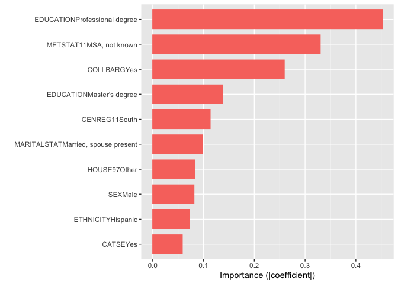

Model Analysis
================

-   [1. Introduction](#1-introduction)
    -   [1.1 Loading Packages](#11-loading-packages)
    -   [1.2 Importing Data](#12-importing-data)
-   [2. Data Preparation](#2-data-preparation)
    -   [2.1 Removing Extraneous
        Variables](#21-removing-extraneous-variables)
    -   [2.2 Transforming and Recoding
        Variables](#22-transforming-and-recoding-variables)
    -   [2.3 Missing Values](#23-missing-values)
-   [3. Defining Functions](#3-defining-functions)
    -   [3.1 Residual Plot Function](#31-residual-plot-function)
    -   [3.2 RMSE Function](#32-rmse-function)
    -   [3.3 Training and Testing
        Errors](#33-training-and-testing-errors)
-   [4. Linear Regression](#4-linear-regression)
    -   [4.1 Reduced Linear Regression](#41-reduced-linear-regression)
    -   [4.2 Stepwise Linear Regression](#42-stepwise-linear-regression)
    -   [4.3 Model Performance](#43-model-performance)
-   [5. LASSO](#5-lasso)
    -   [5.1 Full LASSO](#51-full-lasso)
    -   [5.2 Reduced LASSO](#52-reduced-lasso)
    -   [5.3 Model Performance](#53-model-performance)
-   [6. Dimension Reduction Methods](#6-dimension-reduction-methods)
    -   [6.1 Principal Components
        Regression](#61-principal-components-regression)
    -   [6.2 Partial Least Squares
        Regression](#62-partial-least-squares-regression)
    -   [6.3 Model Performance](#63-model-performance)
-   [7. Tree-Based Methods](#7-tree-based-methods)
    -   [7.1 Random Forest](#71-random-forest)
    -   [7.2 Generalized Boosting Model](#72-generalized-boosting-model)
    -   [7.3 Model Performance](#73-model-performance)
-   [8. Comparing Models](#8-comparing-models)
    -   [8.1 Comparing Model
        Performance](#81-comparing-model-performance)
    -   [8.2 Variable Importance](#82-variable-importance)
    -   [8.3 Discussion](#83-discussion)
-   [9. Conclusion](#9-conclusion)

## 1. Introduction

In this section of the project, I will be focusing on building and
testng models to predict the hourly wage of the NLSY97 respondents based
on their features. I will be using the following methods for building
models: **Linear Regression**, **LASSO Regression**, **Dimension
Reduction Methods**, and **Tree-Based Methods**. Using the testing set,
I will measure the performance of each model by calculating the **Root
Mean Square Error (RMSE)** and comparing them with each other to
determine the best model for predicting hourly wage.

### 1.1 Loading Packages

These are the packages I used in this section of the project.

``` r
# Load required libraries
library(MASS)
library(ISLR)
library(boot)
library(glmnet)
library(ggplot2)
library(ggthemes)
library(DataExplorer)
library(reshape2)
library(pls)
library(randomForest)
library(gbm)
library(vip)
```

I set a seed to obtain reproducible results.

``` r
# Set seed for reproducible results
set.seed(101)
```

### 1.2 Importing Data

I imported both the training set and the testing set. The training set
will be used to build the models while the testing set will be used to
measure performance.

``` r
# Import data
train <- read.csv("data/NLSY97_train.csv")
test <- read.csv("data/NLSY97_test.csv")
```

## 2. Data Preparation

Prior to model building, some data cleaning and preparation is needed,
including variable transformations and addressing missing values. The
data cleaning process will be done on both sets of data.

### 2.1 Removing Extraneous Variables

When I viewed the structure of the data in the EDA section, I noticed 2
extraneous columns: **X**, an index column, and **ID**, a unique
identifier. I removed these variables from the datasets.

``` r
# Remove extra columns from the training and testing set
train <- subset(train, select = -c(X, ID))
test <- subset(test, select = -c(X, ID))
```

### 2.2 Transforming and Recoding Variables

I transformed and recoded the variables as necessary.

``` r
# Create new private sector variable
train$PRIV <- as.factor(ifelse(train$CATEMP == "Private sector", "Yes", "No"))
test$PRIV <- as.factor(ifelse(test$CATEMP == "Private sector", "Yes", "No"))

# Create new marital status variable
train$MARRIED <- as.factor(ifelse(train$MARITALSTAT == "Married, spouse present", "Yes", "No"))
test$MARRIED <- as.factor(ifelse(test$MARITALSTAT == "Married, spouse present", "Yes", "No"))

# Create new household structure variable
train$BIOPARENTS <- as.factor(ifelse(train$HOUSE97 == "Biological mother and father", "Yes", "No"))
test$BIOPARENTS <- as.factor(ifelse(test$HOUSE97 == "Biological mother and father", "Yes", "No"))

# Log transform household income
train$logHHINC97 <- log(train$HHINC97 + 1)
test$logHHINC97 <- log(test$HHINC97 + 1)

# Log transform hourly wage
train$logWAGE <- log(train$EARNINGS)
test$logWAGE <- log(test$EARNINGS)
```

### 2.3 Missing Values

When I first cleaned the data in the data preparation section, I held
off on addressing the missing values. Now that I have determined which
variables to include in the model, I can exclude the variables with lots
of missing values.

``` r
# Plot the missing values of the training set
plot_missing(train, missing_only = TRUE)

# Plot the missing values of the testing set
plot_missing(test, missing_only = TRUE)
```


Since **PRMONF**, **PRMONM**, **MATSTYLE**, **PATSTYLE**, **SFR**, and
**SMR** were determined to be excluded from the model, I decided to drop
these variables from the dataset. Other “insignificant” variables with
missing values will be kept for models that will include all variables
the dataset, but individuals with missing values will be dropped from
the final datasets.

``` r
# Drop variable with lots of missing values
train <- subset(train, select = -c(PRMONM, PRMONF, MATSTYLE, PATSTYLE, SFR, SMR))
test <- subset(test, select = -c(PRMONM, PRMONF, MATSTYLE, PATSTYLE, SFR, SMR))

# Drop rows with missing values
train <- train[complete.cases(train), ]
test <- test[complete.cases(test), ]

# Check the final dimensions of the training and testing sets
dim(train)
```

    ## [1] 912  47

``` r
dim(test)
```

    ## [1] 241  47

The finalized training set contains 912 observations while the finalized
testing set contains 241.

## 3. Defining Functions

I defined some functions that will be used several times throughout the
modeling process.

### 3.1 Residual Plot Function

This function outputs the residual plots of the models.

``` r
# Define function that will print the residual plot
plot.residuals <- function(y.est, model) {
  
  # Calculate residuals
  residuals <- train$logWAGE -  y.est
  
  # Create dataframe of predicted values and residuals
  df.resid <- data.frame(y.est, residuals)
  
  # Plot residual plot
  p <- ggplot(df.resid, aes(x = y.est, y = residuals)) + 
    geom_point() +
    xlab("Predicted log(Hourly Wage)") +
    ggtitle(model) +
    geom_smooth(method = 'lm') +
    theme_economist()
  
  p
}
```

### 3.2 RMSE Function

This function calculates the **Root Mean Squared Error (RMSE)**, which
will be the metric used to calculate model performance.

``` r
# This function calculate the RMSE for log(hourly wage)
rmse <- function(y.est, y) {
  return(sqrt(mean((y - y.est)^2)))
}
```

### 3.3 Training and Testing Errors

This function uses the RMSE function to calculate the **training error**
and **testing error** of the models and stores them in a dataframe.

Four types of errors are calculated for each model:

1.  **train.rmse.log** - RMSE calculated using the training set for
    **logWAGE**
2.  **test.rmse.log** - RMSE calculated using the testing set for
    **logWAGE**
3.  **train.rmse** - RMSE calculated using the training set after
    undoing the log transformation
4.  **test.rmse** - RMSE calculated using the testing set after undoing
    the log transformation

``` r
# This function uses the RMSE function to calculate the training and testing errors
get.errors <- function(model.fit, df.train, df.test, model) {
  
  # Calculate the error for log(WAGE)
  train.rmse.log <- rmse(predict(model.fit, df.train), train$logWAGE)
  test.rmse.log <- rmse(predict(model.fit, df.test), test$logWAGE)
  
  # Calculate the error for hourly wage
  train.rmse <- rmse(exp(predict(model.fit, df.train)), train$EARNINGS)
  test.rmse <- rmse(exp(predict(model.fit, df.test)), test$EARNINGS)
  
  # Create a dataframe to of the calculated errors
  df.mse <- data.frame(model, train.rmse.log, train.rmse, test.rmse.log, test.rmse)
  
  return(df.mse)
}
```

## 4. Linear Regression

The first method I will be using to predict hourly wage is linear
regression.

### 4.1 Reduced Linear Regression

I fit a linear regression model on **logWAGE** and the subset of 11
predictors I determined to be significant from the EDA section.

I will be referring to this model as the **reduced linear regression
model**.

``` r
# Fit the reduced linear regression model
lm.fit <- lm(logWAGE ~ HOURS + TENURE + PRIV + COLLBARG + SEX + ETHNICITY + MARRIED + S + ASVABC4 + logHHINC97 + BIOPARENTS, data = train)

# View summary of the reduced linear regression model          
summary(lm.fit)
```

    ## 
    ## Call:
    ## lm(formula = logWAGE ~ HOURS + TENURE + PRIV + COLLBARG + SEX + 
    ##     ETHNICITY + MARRIED + S + ASVABC4 + logHHINC97 + BIOPARENTS, 
    ##     data = train)
    ## 
    ## Residuals:
    ##      Min       1Q   Median       3Q      Max 
    ## -2.25124 -0.23973 -0.01727  0.25947  2.27100 
    ## 
    ## Coefficients:
    ##                                  Estimate Std. Error t value Pr(>|t|)    
    ## (Intercept)                      0.773145   0.220943   3.499 0.000489 ***
    ## HOURS                            0.007765   0.001511   5.139 3.39e-07 ***
    ## TENURE                           0.037812   0.006157   6.142 1.23e-09 ***
    ## PRIVYes                          0.038088   0.038419   0.991 0.321773    
    ## COLLBARGYes                      0.309638   0.052104   5.943 4.01e-09 ***
    ## SEXMale                          0.140644   0.033202   4.236 2.51e-05 ***
    ## ETHNICITYHispanic                0.198401   0.070089   2.831 0.004748 ** 
    ## ETHNICITYNon-black, non-hispanic 0.058129   0.056050   1.037 0.299968    
    ## MARRIEDYes                       0.116745   0.033024   3.535 0.000428 ***
    ## S                                0.048552   0.007657   6.341 3.61e-10 ***
    ## ASVABC4                          0.046516   0.021739   2.140 0.032641 *  
    ## logHHINC97                       0.054336   0.019072   2.849 0.004487 ** 
    ## BIOPARENTSYes                    0.025370   0.036741   0.691 0.490057    
    ## ---
    ## Signif. codes:  0 '***' 0.001 '**' 0.01 '*' 0.05 '.' 0.1 ' ' 1
    ## 
    ## Residual standard error: 0.4823 on 899 degrees of freedom
    ## Multiple R-squared:  0.2647, Adjusted R-squared:  0.2549 
    ## F-statistic: 26.98 on 12 and 899 DF,  p-value: < 2.2e-16

**Summary of Findings**:

-   The estimated coefficients for all variables are positive. This
    means that **logWAGE** increases as the continuous predictors
    (**JOBS**, **TENURE**, **S**, **ASVABC4**, and **logHHINC97**)
    increase.
-   It also means that **logWAGE** is higher if a participant works at a
    private sector, is male, has pay set by collective bargaining, is
    Hispanic or non-black and non-Hispanic, is married with spouse
    present, and has both biological parents.
-   The estimated coefficients for all variables except **PRIV**,
    **ETHNICITYNon-black, non-hispanic**, and **BIOPARENTSYes** are
    significant.
-   The model has an r-squared value of 0.265, which means that 26.5% of
    the variance in **logWAGE** can be explained by the independent
    variables in the model.

### 4.2 Stepwise Linear Regression

I decided to run a **stepwise selection** method that uses the **Akaike
information criterion (AIC)** to determine a subset of variables that
will result in a model with the lowest AIC value. I want to see how the
resulting subset of variables differ from the ones I manually selected,
so I included all variables in this method.

I will be referring to this model as the **stepwise linear regression
model**.

``` r
# Fit linear regression model on all variables
lm.fit.full <- lm(logWAGE ~ . - EARNINGS - PRIV - MARRIED - HHINC97 - BIOPARENTS, data = train)

# Run stepwise selection on the resulting linear regression model
lm.step.fit <- stepAIC(lm.fit.full, direction = "both", trace = 0)

# View summary of the resulting model            
summary(lm.step.fit)
```

    ## 
    ## Call:
    ## lm(formula = logWAGE ~ S + EXP + BYEAR + ASVABWK + ASVABPC + 
    ##     ASVABC4 + VERBAL + HEIGHT + WEIGHT11 + SIBLINGS + HOURS + 
    ##     TENURE + CATSE + COLLBARG + SEX + ETHNICITY + EDUCATION + 
    ##     MARITALSTAT + METSTAT97 + METSTAT11 + CENREG11 + AREA11 + 
    ##     logHHINC97, data = train)
    ## 
    ## Residuals:
    ##      Min       1Q   Median       3Q      Max 
    ## -2.02476 -0.22041  0.00212  0.23172  2.14269 
    ## 
    ## Coefficients:
    ##                                      Estimate Std. Error t value Pr(>|t|)    
    ## (Intercept)                        -1.223e+02  3.942e+01  -3.103 0.001980 ** 
    ## S                                   3.158e-02  1.428e-02   2.211 0.027319 *  
    ## EXP                                 3.712e-02  8.897e-03   4.172 3.32e-05 ***
    ## BYEAR                               4.106e-02  1.307e-02   3.142 0.001734 ** 
    ## ASVABWK                             5.638e+04  4.063e+04   1.388 0.165616    
    ## ASVABPC                             5.638e+04  4.063e+04   1.388 0.165616    
    ## ASVABC4                             1.382e-01  5.228e-02   2.643 0.008354 ** 
    ## VERBAL                             -1.057e+05  7.619e+04  -1.388 0.165615    
    ## HEIGHT                              1.406e-02  5.966e-03   2.357 0.018626 *  
    ## WEIGHT11                           -1.226e-03  3.822e-04  -3.208 0.001384 ** 
    ## SIBLINGS                           -2.205e-02  1.065e-02  -2.071 0.038617 *  
    ## HOURS                               6.029e-03  1.501e-03   4.017 6.39e-05 ***
    ## TENURE                              3.038e-02  6.293e-03   4.828 1.63e-06 ***
    ## CATSEYes                            1.088e-01  6.237e-02   1.744 0.081443 .  
    ## COLLBARGYes                         2.963e-01  5.013e-02   5.912 4.86e-09 ***
    ## SEXMale                             1.189e-01  4.712e-02   2.522 0.011834 *  
    ## ETHNICITYHispanic                   1.030e-01  7.055e-02   1.460 0.144694    
    ## ETHNICITYNon-black, non-hispanic   -1.192e-02  5.696e-02  -0.209 0.834335    
    ## EDUCATIONBachelor's degree          8.257e-02  6.274e-02   1.316 0.188454    
    ## EDUCATIONDoctorate                  4.791e-02  3.388e-01   0.141 0.887598    
    ## EDUCATIONGED                       -1.757e-01  9.359e-02  -1.877 0.060796 .  
    ## EDUCATIONHigh school diploma       -9.879e-02  6.103e-02  -1.619 0.105867    
    ## EDUCATIONHigh school drop-out      -5.034e-02  1.207e-01  -0.417 0.676630    
    ## EDUCATIONMaster's degree            2.217e-01  8.723e-02   2.541 0.011212 *  
    ## EDUCATIONProfessional degree        6.326e-01  1.462e-01   4.328 1.68e-05 ***
    ## MARITALSTATMarried, spouse present  1.116e-01  4.477e-02   2.494 0.012816 *  
    ## MARITALSTATOther single             6.889e-02  7.022e-02   0.981 0.326837    
    ## MARITALSTATSingle, never married   -1.617e-02  4.675e-02  -0.346 0.729556    
    ## METSTAT97MSA, not central city      3.774e-02  4.014e-02   0.940 0.347354    
    ## METSTAT97MSA, not known             2.333e-01  1.798e-01   1.297 0.194840    
    ## METSTAT97Not in MSA                -9.092e-02  4.858e-02  -1.872 0.061596 .  
    ## METSTAT11MSA, not central city     -6.838e-02  3.608e-02  -1.895 0.058395 .  
    ## METSTAT11MSA, not known             8.289e-01  4.684e-01   1.770 0.077138 .  
    ## METSTAT11Not in MSA                -3.323e-02  8.736e-02  -0.380 0.703770    
    ## CENREG11North east                  8.352e-02  4.983e-02   1.676 0.094075 .  
    ## CENREG11South                       1.737e-01  4.473e-02   3.884 0.000111 ***
    ## CENREG11West                        6.026e-02  4.064e-02   1.483 0.138504    
    ## AREA11Unknown                      -4.260e-01  3.320e-01  -1.283 0.199692    
    ## AREA11Urban                        -7.146e-02  4.058e-02  -1.761 0.078571 .  
    ## logHHINC97                          3.552e-02  1.825e-02   1.947 0.051848 .  
    ## ---
    ## Signif. codes:  0 '***' 0.001 '**' 0.01 '*' 0.05 '.' 0.1 ' ' 1
    ## 
    ## Residual standard error: 0.4591 on 872 degrees of freedom
    ## Multiple R-squared:  0.3538, Adjusted R-squared:  0.3249 
    ## F-statistic: 12.24 on 39 and 872 DF,  p-value: < 2.2e-16

**Summary of Findings**:

-   23 out of the 41 potential variables were included in the resulting
    model.
-   The variables included in the reduced model are also present in the
    stepwise model except for the transformed variables **PRIV**,
    **MARRIED**, and **BIOPARENTS**.
-   This model’s r-squared value is .354, which means that 35.4% of the
    variance in **logWAGE** can be explained by the independent
    variables in the model.

### 4.3 Model Performance

``` r
# Plot residuals of the reduced linear regression model
plot.residuals(predict(lm.fit), "Residual Plot (Reduced Linear Regression)")

# Plot residuals of the stepwise linear regression model
plot.residuals(predict(lm.step.fit), "Residual Plot (Stepwise Linear Regression)")
```


The residual plots of both models appear to be randomly distributed with
a mean of 0, which means that both models fit well. Although the
stepwise linear regression has a higher r-squared value, it might be due
to the fact that it contains more predictors than the reduced model.

``` r
# Calculate the training and testing errors of the linear regression models
df.rmse.lm <- rbind(get.errors(lm.fit, train, test, "Linear Regression (Reduced)"),
                   get.errors(lm.step.fit, train, test, "Linear Regression (Stepwise)"))

# View the table of training and testing errors
df.rmse.lm
```

    ##                          model train.rmse.log train.rmse test.rmse.log
    ## 1  Linear Regression (Reduced)      0.4788233   11.05933     0.4850445
    ## 2 Linear Regression (Stepwise)      0.4488995   10.34880     0.4841726
    ##   test.rmse
    ## 1  11.17275
    ## 2  10.73266

The training and testing root mean squared error is lower for the
stepwise linear regression model. On average, a prediction made by this
model is about $10.73 off the actual hourly wage after undoing the log
transformation. As expected, the testing errors are slightly higher than
the training errors, indicating a good fit for the models.

## 5. LASSO

The **LASSO**, or **least absolute shrinkage and selection operator**,
works the same way as the linear regression model except it uses a
shrinkage penalty when estimating the coefficients. Since it has the
ability to shrink the coefficients to 0, it can also perform variable
selection.

### 5.1 Full LASSO

Since the LASSO model can perform variable selection, I decided to fit
the model on all the predictors prior to any transformations. I will
refer to this model as the **full LASSO model**.

To fit a LASSO model, I first defined a model matrix of my x values
(predictors).

Note that I excluded the variable **AREA11** from the model since the
training set has 3 levels (uban, rural, unknown) while the testing set
only has 2 levels (urban and rural). This will result in an error when
running the LASSO model if left in.

``` r
# Obtain model matrix of the training set for the full model
x.full <- model.matrix(logWAGE ~ . - EARNINGS - PRIV - MARRIED - HHINC97 - BIOPARENTS - AREA11, train)[,-1]

# Obtain y observations of the training set
y.train <- train$logWAGE
```

One of the parameters for the LASSO model is the **tuning parameter**,
denoted by lambda. The tuning parameter determines the weight of the
shrinkage penalty. I used cross-validation to determine the optimal
value of lambda that results in the lowest MSE.

``` r
# Estimate lambda using cross-validation
lasso.cv <- cv.glmnet(x.full, y.train, alpha = 1)

# Obtain minimum lambda value
lambda.cv <- lasso.cv$lambda.min
lambda.cv
```

    ## [1] 0.01304051

With the optimal tuning parameter, I can now fit the LASSO model on the
data.

``` r
# Fit the full LASSO model
lasso.full.fit<- glmnet(x.full, y.train, alpha = 1, lambda = lambda.cv)

# Obtain the full LASSO model coefficients
coef(lasso.full.fit)
```

    ## 68 x 1 sparse Matrix of class "dgCMatrix"
    ##                                                   s0
    ## (Intercept)                            -2.018110e+01
    ## S                                       3.092086e-02
    ## EXP                                     2.021637e-02
    ## BYEAR                                   1.059208e-02
    ## AGE                                    -2.257160e-15
    ## AGEMBTH                                 .           
    ## POVRAT97                                .           
    ## ASVABAR                                 2.600869e-03
    ## ASVABWK                                 .           
    ## ASVABPC                                 .           
    ## ASVABMK                                 4.526499e-02
    ## ASVABNO                                 .           
    ## ASVABCS                                 .           
    ## ASVABC                                  .           
    ## ASVABC4                                 .           
    ## VERBAL                                  .           
    ## ASVABMV                                 .           
    ## HEIGHT                                  1.057986e-02
    ## WEIGHT04                                .           
    ## WEIGHT11                               -7.600599e-04
    ## SF                                      1.247751e-03
    ## SM                                      .           
    ## SIBLINGS                               -1.428758e-02
    ## JOBS                                   -5.980870e-03
    ## HOURS                                   6.105742e-03
    ## TENURE                                  2.607292e-02
    ## CATSEYes                                5.819895e-02
    ## COLLBARGYes                             2.590348e-01
    ## SEXMale                                 8.119500e-02
    ## ETHNICITYHispanic                       7.177895e-02
    ## ETHNICITYNon-black, non-hispanic        .           
    ## EDUCATIONBachelor's degree              4.119981e-02
    ## EDUCATIONDoctorate                      .           
    ## EDUCATIONGED                           -8.121526e-02
    ## EDUCATIONHigh school diploma           -5.082626e-02
    ## EDUCATIONHigh school drop-out           .           
    ## EDUCATIONMaster's degree                1.369968e-01
    ## EDUCATIONProfessional degree            4.518563e-01
    ## MARITALSTATMarried, spouse present      9.820014e-02
    ## MARITALSTATOther single                 .           
    ## MARITALSTATSingle, never married        .           
    ## FAITHJewish                             .           
    ## FAITHMissing value                      .           
    ## FAITHNone                              -2.954806e-02
    ## FAITHOther                              .           
    ## FAITHProtestant                         .           
    ## METSTAT97MSA, not central city          8.329934e-03
    ## METSTAT97MSA, not known                 .           
    ## METSTAT97Not in MSA                    -8.753770e-02
    ## AREA97Urban                             3.548211e-03
    ## CENREG97North east                      2.743683e-02
    ## CENREG97South                           .           
    ## CENREG97West                            .           
    ## HOUSE97Biological mother and father     9.044557e-03
    ## HOUSE97Biological mother only           .           
    ## HOUSE97Biological mother, other father  .           
    ## HOUSE97Other                            8.240033e-02
    ## HOUSE97Other mother, biological father  .           
    ## CATEMPMissing value                     .           
    ## CATEMPNon-profit                        .           
    ## CATEMPPrivate sector                    .           
    ## METSTAT11MSA, not central city         -1.967820e-02
    ## METSTAT11MSA, not known                 3.297975e-01
    ## METSTAT11Not in MSA                     .           
    ## CENREG11North east                      .           
    ## CENREG11South                           1.130735e-01
    ## CENREG11West                            .           
    ## logHHINC97                              3.391764e-02

**Summary of Findings**:

-   67 potential variables were considered for the LASSO model. These
    additional variables are the dummy variables representing the levels
    of the categorical variables.
-   34 of these 67 variables were included in the LASSO model.
-   Of the 11 predictors I manually selected, 7 are also present in this
    model: **S**, **COLLBARG**, **HOURS**, **TENURE**, **SEX**,
    **ETHNICITY**, and **logHHINC97**.
-   The coefficients of these common predictors are different from the
    linear regression models.

### 5.2 Reduced LASSO

Next, I fit a LASSO model using the subset of variables I manually
selected from the EDA to see if it would shrink any of those
coefficients to 0. This model will be referred to as the **reduced LASSO
model**. Similar to the previous section, I obtained my model matrix and
found the optimal tuning parameter using cross-validation.

``` r
# Obtain model matrix of the training set for the reduced model
x <- model.matrix(logWAGE ~ HOURS + TENURE + PRIV + COLLBARG + SEX + ETHNICITY + MARRIED + S + ASVABC4 + logHHINC97 + BIOPARENTS, train)[,-1]

# Estimate lambda using cross-validation
lasso.cv <- cv.glmnet(x, y.train, alpha = 1)

# Obtain minimum lambda value
lambda.cv <- lasso.cv$lambda.min
lambda.cv
```

    ## [1] 0.000551515

``` r
# Fit the reduced LASSO model
lasso.fit <- glmnet(x, y.train, alpha = 1, lambda = lambda.cv)

# Obtain the reduced LASSO model coefficients
coef(lasso.fit)
```

    ## 13 x 1 sparse Matrix of class "dgCMatrix"
    ##                                           s0
    ## (Intercept)                      0.785318732
    ## HOURS                            0.007739643
    ## TENURE                           0.037636565
    ## PRIVYes                          0.036415174
    ## COLLBARGYes                      0.307559878
    ## SEXMale                          0.139732997
    ## ETHNICITYHispanic                0.193478446
    ## ETHNICITYNon-black, non-hispanic 0.054702305
    ## MARRIEDYes                       0.116207824
    ## S                                0.048341808
    ## ASVABC4                          0.046517571
    ## logHHINC97                       0.054173733
    ## BIOPARENTSYes                    0.024796133

None of the coefficients were excluded from the model. Similar to the
reduced linear regression model, all estimated coefficients are
positive. In fact, the values of the estimated coefficients are almost
the same as the reduced linear regression.

### 5.3 Model Performance

``` r
# Plot residuals of the full LASSO model
plot.residuals(predict(lasso.full.fit, newx = x.full), "Residual Plot (Full LASSO)")

# Plot residuals of the reduced LASSO model
plot.residuals(predict(lasso.fit, newx = x), "Residual Plot (Reduced LASSO)")
```


The residual plot for the full LASSO model appear to have a small,
linear, upward trend. The residual plot for the reduced model appear to
be randomly distributed with a mean of 0. Thus, the reduced model fits
better than the full model.

``` r
# Obtain model matrix of the testing set for the reduced model
x.test <- model.matrix(logWAGE ~ HOURS + TENURE + PRIV + COLLBARG + SEX + ETHNICITY + MARRIED + S + ASVABC4 + logHHINC97 + BIOPARENTS, test)[,-1]

# Obtain model matrix of the testing set for the full model
x.full.test <- model.matrix(logWAGE ~ . - EARNINGS - PRIV - MARRIED - HHINC97 - BIOPARENTS - AREA11, test)[,-1]

# Calculate the training and testing errors of the LASSO models
df.rmse.lasso <- rbind(get.errors(lasso.full.fit, x.full, x.full.test, "LASSO (Full)"),
                      get.errors(lasso.fit, x, x.test, "LASSO (Reduced)"))

# View table of training and testing errors of the LASSO models
df.rmse.lasso
```

    ##             model train.rmse.log train.rmse test.rmse.log test.rmse
    ## 1    LASSO (Full)      0.4564005   10.58386     0.4739932  10.61441
    ## 2 LASSO (Reduced)      0.4788272   11.06059     0.4850144  11.17391

The full LASSO model has lower error for all values across the board
compared to the reduced model. However, the difference in performance
may not make up for the complexity of the full model. On average, a
prediction made by this model is about $10.61 off the actual wage.

## 6. Dimension Reduction Methods

The next two methods I will be using, **Principal Components Regression
(PCR)** and **Partial Least Squares Regression (PLSR)**, are dimension
reduction methods. Since these methods reduce the number of predictors
included in the model, I will include all predictors when fitting these
models.

### 6.1 Principal Components Regression

Principal components regression uses the principal components
constructed during **principal component analysis (PCA)** as predictors.

First, I need to determine the number of components to include in the
model. In the function *pcr* from the *pls* library, the setting the
parameter *validation* equal to *“CV”* will perform 10-fold
cross-validation for each possible component.

``` r
# Fit a principal components regression model with cross-validation
pcr.fit <- pcr(logWAGE ~ . - EARNINGS - PRIV - MARRIED - HHINC97 - BIOPARENTS - AREA11, data = train, scale = TRUE, validation = "CV")
```

Next, I plotted the calculated MSE values to determine the optimal
number of components.

``` r
# Plot the MSE values from the PCR model
validationplot(pcr.fit, val.type = "MSEP")
```

<!-- -->

Based on this plot, the optimal number of components is around 18 as the
MSE does not decrease by a significant amount as the number of
components continue to increase.

I will now fit the PCR model with a specified number of components of
18.

``` r
# Fit a PCR model where the number of components = 18
pcr.fit <- pcr(logWAGE ~ . - EARNINGS - PRIV - MARRIED - HHINC97 - BIOPARENTS - AREA11, data = train, scale = TRUE, ncomp = 18)

# View a summary of the model fit
summary(pcr.fit)
```

    ## Data:    X dimension: 912 67 
    ##  Y dimension: 912 1
    ## Fit method: svdpc
    ## Number of components considered: 18
    ## TRAINING: % variance explained
    ##          1 comps  2 comps  3 comps  4 comps  5 comps  6 comps  7 comps  8 comps
    ## X          14.98   19.386   23.738    27.78    31.57    35.04    38.28    41.17
    ## logWAGE     8.57    9.482    9.498    11.45    13.21    13.94    14.29    15.90
    ##          9 comps  10 comps  11 comps  12 comps  13 comps  14 comps  15 comps
    ## X          43.91     46.50     48.79     50.93     52.98     54.95     56.91
    ## logWAGE    17.13     17.75     18.43     20.48     22.18     24.60     25.30
    ##          16 comps  17 comps  18 comps
    ## X           58.75     60.58     62.38
    ## logWAGE     26.39     26.62     27.24

Having 18 components captures 62.4% of all the variance in the
predictors, while 27.2% of the response variable is explained by the
model fit. Since there is no direct interpretation for these values,
there are no estimated coefficients provided in the summary.

### 6.2 Partial Least Squares Regression

Partial least squares regression, or PLSR, is similar to PCR except it
utilizes the response variable when calculating the values of the new
predictors.

As I did in the previous section, I used cross-validation to determine
the optimal number of components.

``` r
# Fit a PLSR model with cross-validation
pls.fit <- plsr(logWAGE ~ . - EARNINGS - PRIV - MARRIED - HHINC97 - BIOPARENTS - AREA11, data = train, scale = TRUE, validation = "CV")

# Plot the MSE values of the PLSR model
validationplot(pls.fit, val.type = "MSEP")
```

<!-- -->

Based on the plot, the optimal number of components is 3.

``` r
# Fit a PLSR model with a specified number of components = 3
pls.fit <- plsr(logWAGE ~ . - EARNINGS - PRIV - MARRIED - HHINC97 - BIOPARENTS - AREA11, data = train, scale = TRUE, ncomp = 3)

# View a summary of the model
summary(pls.fit)
```

    ## Data:    X dimension: 912 67 
    ##  Y dimension: 912 1
    ## Fit method: kernelpls
    ## Number of components considered: 3
    ## TRAINING: % variance explained
    ##          1 comps  2 comps  3 comps
    ## X          14.05    17.95    20.77
    ## logWAGE    16.96    31.54    34.39

Having 3 components captures 20.8% of all the variance in the
predictors, which is significantly lower than the PCR model. However,
34.4% of the response variable is explained by the PLSR fit, which is
greater than the PCR model. Similar to the PCR model, there is not a
direct interpretation of these values, so no coefficients were provided
in the summary of the model.

### 6.3 Model Performance

``` r
# Plot residuals of the PCR model
plot.residuals(predict(pcr.fit, train, ncomp = 18), "Principal Components Regression")

# Plot residuals of the PLSR model
plot.residuals(predict(pls.fit, train, ncomp = 3), "Partial Least Squares Regression")
```


The residual plots of both models appear to be randomly distributed with
a mean of 0, indicating a good linear fit for both the models.

``` r
# Calculate the RMSE of the PCR model for logWage
train.rmse.log <- rmse(predict(pcr.fit, train, ncomp = 18), train$logWAGE)
test.rmse.log <- rmse(predict(pcr.fit, test, ncomp = 18), test$logWAGE)

# Calculate the RMSE of the PCR model for EARNINGS
train.rmse <- rmse(exp(predict(pcr.fit, train, ncomp = 18)), train$EARNINGS)
test.rmse <- rmse(exp(predict(pcr.fit, test, ncomp = 18)), test$EARNINGS)

# Create a dataframe of the RMSE values
df.pcr <- data.frame("Principal Components Regression", train.rmse.log, train.rmse, test.rmse.log, test.rmse)
colnames(df.pcr) <- c("model", "train.rmse.log", "train.rmse", "test.rmse.log", "test.rmse")

# Calculate the RMSE of the PLSR model for logWage
train.rmse.log <- rmse(predict(pls.fit, train, ncomp = 3), train$logWAGE)
test.rmse.log <- rmse(predict(pls.fit, test, ncomp = 3), test$logWAGE)
 
# Calculate the RMSE of the PLSR model for EARNINGS
train.rmse <- rmse(exp(predict(pls.fit, train, ncomp = 3)), train$EARNINGS)
test.rmse <- rmse(exp(predict(pls.fit, test, ncomp = 3)), test$EARNINGS)

# Create a dataframe of the RMSE values
df.pls <- data.frame("Partial Least Squares", train.rmse.log, train.rmse, test.rmse.log, test.rmse)
colnames(df.pls) <- c("model", "train.rmse.log", "train.rmse", "test.rmse.log", "test.rmse")

# Combine the two dataframes together
df.rmse.dim <- rbind(df.pcr, df.pls)

# View the dataframe
df.rmse.dim 
```

    ##                             model train.rmse.log train.rmse test.rmse.log
    ## 1 Principal Components Regression      0.4763274   10.85598     0.4770808
    ## 2           Partial Least Squares      0.4523282   10.41358     0.4885381
    ##   test.rmse
    ## 1  10.81361
    ## 2  10.76854

The partial least squares regression model has a slightly lower training
RMSE error than the principal components regression model. However,
their testing errors are almost the same: 10.81 vs. 10.77.

## 7. Tree-Based Methods

The final two methods I will be using are tree-based methods: **Random
Forest** and **Generalized Boosting Models**.

### 7.1 Random Forest

I fit a random forest model on all the predictors with the default
number of trees of 500. To determine the optimal number of trees, I
plotted the calculated training errors for each number of tree.

``` r
# Set seed
set.seed(101)

# Fit random forest model with n = 500 trees
rf.fit<- randomForest(logWAGE ~ . - EARNINGS - PRIV - MARRIED - HHINC97 - BIOPARENTS - AREA11, data = train)

# Plot the training MSE error to determine the optimal number of trees
plot(1:500, rf.fit$mse, col = "red", type = "l", xlab = "Number of Trees", ylab = "Training MSE")
```

<!-- -->

Based on the MSE plot, the optimal number of trees is around 50 as the
training MSE does not decrease by much as the number of trees continues
to increase.

``` r
# Set seed
set.seed(101)

# Fit random forest model
rf.fit <- randomForest(logWAGE ~ . - EARNINGS - PRIV - MARRIED - HHINC97 - BIOPARENTS - AREA11, data = train, ntree = 50)

# Summarize coefficients
print(rf.fit)
```

    ## 
    ## Call:
    ##  randomForest(formula = logWAGE ~ . - EARNINGS - PRIV - MARRIED -      HHINC97 - BIOPARENTS - AREA11, data = train, ntree = 50) 
    ##                Type of random forest: regression
    ##                      Number of trees: 50
    ## No. of variables tried at each split: 13
    ## 
    ##           Mean of squared residuals: 0.2432783
    ##                     % Var explained: 21.98

The resulting random forest model has a mean of squared residuals of
0.243. The percent of variance explained by the predictors is 22.0%

### 7.2 Generalized Boosting Model

The next method I will be using is a boosted model. I set the
*interaction.depth* equal to 2 to allow 2-way **interaction effects** in
the model. I kept the number of trees as default, which is 100.

``` r
# Set seed
set.seed(101)

# Fit a boosting model
gb.fit <- gbm(logWAGE ~ . - EARNINGS - PRIV - MARRIED - HHINC97 - BIOPARENTS - AREA11, data = train, distribution = "gaussian", interaction.depth = 2)

# Summarize the boosted model fit
summary(gb.fit)
```

<!-- -->

    ##                     var    rel.inf
    ## HOURS             HOURS 15.0886970
    ## TENURE           TENURE 10.7508626
    ## EDUCATION     EDUCATION 10.3937068
    ## logHHINC97   logHHINC97  7.3851789
    ## S                     S  6.2884193
    ## COLLBARG       COLLBARG  4.7699696
    ## ASVABMK         ASVABMK  4.2891870
    ## HEIGHT           HEIGHT  3.8394625
    ## EXP                 EXP  3.5704925
    ## POVRAT97       POVRAT97  3.0336367
    ## METSTAT97     METSTAT97  2.5078360
    ## CENREG11       CENREG11  2.3339096
    ## CATSE             CATSE  2.1880478
    ## ASVABAR         ASVABAR  2.1856158
    ## SEX                 SEX  2.1444123
    ## SIBLINGS       SIBLINGS  1.7971738
    ## WEIGHT11       WEIGHT11  1.6584905
    ## MARITALSTAT MARITALSTAT  1.6555583
    ## AGEMBTH         AGEMBTH  1.6012859
    ## ASVABNO         ASVABNO  1.4278695
    ## HOUSE97         HOUSE97  1.4086212
    ## CENREG97       CENREG97  1.2155035
    ## ASVABMV         ASVABMV  1.1695935
    ## WEIGHT04       WEIGHT04  1.1303877
    ## JOBS               JOBS  0.9756076
    ## ETHNICITY     ETHNICITY  0.9430739
    ## SF                   SF  0.6594590
    ## VERBAL           VERBAL  0.6376949
    ## BYEAR             BYEAR  0.5998305
    ## FAITH             FAITH  0.5722036
    ## ASVABC           ASVABC  0.5587598
    ## ASVABCS         ASVABCS  0.4843075
    ## METSTAT11     METSTAT11  0.3490353
    ## ASVABWK         ASVABWK  0.2098369
    ## ASVABC4         ASVABC4  0.1762724
    ## AGE                 AGE  0.0000000
    ## ASVABPC         ASVABPC  0.0000000
    ## SM                   SM  0.0000000
    ## AREA97           AREA97  0.0000000
    ## CATEMP           CATEMP  0.0000000

The resulting boosted model measures the relative influence of each
predictor in the model. The variables with the highest relative
influence are **HOURS**, **EDUCATION**, **TENURE**, **logHHINC97**, and
**S**.

The **partial dependence plots** of these variables are shown below.
These plots illustrate the marginal effect of the variables after
integrating out the other variables.

``` r
# Plot partial dependence plot of the variables with the higher relative importance
plot(gb.fit, i = "HOURS")
plot(gb.fit, i = "TENURE")
plot(gb.fit, i = "logHHINC97")
plot(gb.fit, i = "S")
```


As expected, **logWAGE** increases as hours, tenure, schooling, and
income increase. However, hourly wage does not start increasing for
schooling until approximately 15 years and for **logHHINC97** until 10.
In addition, hourly wage stops increasing after approximately 50 hours
and after a tenure of approximately 4 years.

### 7.3 Model Performance

Next, I calculated the training and testing errors of the random forest
and boosting models.

``` r
# Calculate the RMSE of the boosted model for logWAGE
train.rmse.log <- rmse(predict(gb.fit, train, n.trees = 100), train$logWAGE)
test.rmse.log <- rmse(predict(gb.fit, test, n.trees = 100), test$logWAGE)

# Calculate the RMSE of the boosted model for EARNINGS
train.rmse <- rmse(exp(predict(gb.fit, train, n.trees = 100)), train$EARNINGS)
test.rmse <- rmse(exp(predict(gb.fit, test, n.trees = 100)), test$EARNINGS)

# Create a dataframe of the RMSE values
df.gb <- data.frame("Boosting", train.rmse.log, train.rmse, test.rmse.log, test.rmse)
colnames(df.gb) <- c("model", "train.rmse.log", "train.rmse", "test.rmse.log", "test.rmse")
```

``` r
# Combine dataframes containing the errors of the boosted and random forest models
df.rmse.tree <- rbind(get.errors(rf.fit, train, test, "Random Forest"), df.gb)

# View the dataframe of errors
df.rmse.tree
```

    ##           model train.rmse.log train.rmse test.rmse.log test.rmse
    ## 1 Random Forest      0.2077698   6.248215     0.4532262  10.76250
    ## 2      Boosting      0.4031695   9.680139     0.4540635  10.47672

The training errors of both the random forest and boosting models are
both significantly lower than the previous models. However, their
testing errors are around the same range as the other models. Since the
testing errors are somewhat significantly higher than the training
errors, there is some potential overfitting that can be occurring in
these models.

## 8. Comparing Models

The **Root Mean Squared Error** was chosen as the metric used to measure
these models’ performance. Each model has two variations of the RMSE for
the training error and two variations for the testing error. Since the
RMSE is more interpretable after undoing the log transformation, I
focused more on those values.

### 8.1 Comparing Model Performance

I combined all the dataframes containing the training and testing errors
and displayed it below.

``` r
# Combine the RMSE dataframes
rmse.df <- rbind(df.rmse.lm, df.rmse.lasso, df.rmse.dim, df.rmse.tree)

# View the table of RMSE values of all models
rmse.df
```

    ##                             model train.rmse.log train.rmse test.rmse.log
    ## 1     Linear Regression (Reduced)      0.4788233  11.059333     0.4850445
    ## 2    Linear Regression (Stepwise)      0.4488995  10.348801     0.4841726
    ## 3                    LASSO (Full)      0.4564005  10.583856     0.4739932
    ## 4                 LASSO (Reduced)      0.4788272  11.060595     0.4850144
    ## 5 Principal Components Regression      0.4763274  10.855979     0.4770808
    ## 6           Partial Least Squares      0.4523282  10.413582     0.4885381
    ## 7                   Random Forest      0.2077698   6.248215     0.4532262
    ## 8                        Boosting      0.4031695   9.680139     0.4540635
    ##   test.rmse
    ## 1  11.17275
    ## 2  10.73266
    ## 3  10.61441
    ## 4  11.17391
    ## 5  10.81361
    ## 6  10.76854
    ## 7  10.76250
    ## 8  10.47672

The range of the training errors for **logWAGE** is 0.21 to 0.48 while
the range of the training errors for **EARNINGS** is 6.25 to 11.06. The
spread of the testing errors is much smaller, which is 0.45 to 0.49 or
10.48 to 11.17.

Since the units of the RMSE values for **EARNINGS** is in dollars, it is
much more interpretable. It is the average distance between the observed
values and the predicted values from the models. I plotted the errors of
these values below.

``` r
# Expand dataframe to a long format
metrics.long <- melt(rmse.df, id.vars = "model", variable.name = "error")

# Subset metrics for hourly wage
metrics.long.reg <- subset(metrics.long, error == 'train.rmse' | error == "test.rmse")

# Subset metrics for log(hourly wage)
metrics.long.log <- subset(metrics.long, error == 'train.rmse.log' | error == "test.rmse.log")
```

``` r
# Plot metrics for hourly wage
ggplot(metrics.long.reg, aes(model, value, group = error)) +
  geom_point(aes(color = error), size = 3) + 
  geom_line(aes(color = error), size = 1) + 
  scale_color_manual(values = c("#21ABA5", "#163A5F")) +
  ylim(6, 12) +
  ylab("Dollars") +
  ggtitle("Model Performance for Hourly Wage") +
  theme_economist() +
  theme(axis.text.x = element_text(angle = 15, vjust = 0.5),
        axis.title.x = element_blank())
```

<!-- -->

As expected, the testing errors are generally higher than the training
errors. The testing errors are generally the same for all the models,
while the training errors are the same for all the models except for the
random forest and boosting models, which have lower training errors.

The boosting model and the full LASSO model had the lowest testing
errors, while the reduced linear regression and reduced LASSO model had
the highest testing errors.

### 8.2 Variable Importance

The LASSO and tree-based models have the ability to measure **variable
importance**. For the LASSO models, the variable importance is measured
by the absolute value of the estimated coefficients of the predictors.
For a random forest model, it is measured by the increase in **node
purity**, which measures how much a split reduces the **residual sum of
squares** or **RSS**. Finally, the variable importance for the boosting
model is measure by relative influence, which was previously seen when
printing out the summary of the model.

``` r
# Plot variable importance of the reduced LASSO model
vip(lasso.fit)

# PLot variable importance of the full LASSO model
vip(lasso.full.fit)

# Plot variable importance of the random forest model
vip(rf.fit)

# PLot variable importance of the boosting model
vip(gb.fit)
```



**Summary of Findings**:

-   The variable importance shows which variables are the most important
    when predicting hourly wage in their respective models.
-   For the reduced LASSO model, these variables are: **COLLBARG**,
    **ETHNICITY**, **SEX**, and **MARRIED**.
-   For the full LASSO model, these variables are: **EDUCATION**,
    **METSTAT11**, and **COLLBARG**.
-   For the random forest model, these variables are: **HOURS**,
    **TENURE**, **EDUCATION**, **ASVABMK**, **logHHINC97**, and **S**.
-   For the boosting model, these variables are: **HOURS**,
    **EDUCATION**, **TENURE**, **logHHINC97**, and **S**.

### 8.3 Discussion

Focusing mainly on the testing error, all the models performed
relatively the same. These values Although the training errors for the
random forest and boosting models were significantly lower, the testing
errors is a better representation of how a model will perform when used
on unseen or new data.

Although the **boosting** and **full LASSO** models had the lowest
testing errors, they are a little bit difficult to interpret. However,
it is possible to gain some insight on which predictors are important in
predicting hourly wage in these models using variable importance.

The models with the highest testing errors are the **reduced linear
regression** and **reduced LASSO** models. Even though they performed
the worst, they are much more interpretable due to the relatively small
number of predictors in these models.

Overall, I think the best model is the **boosting model** due to it
having the lowest error of 10.48. This means that on average, a
prediction made by this model is about $10.48 off the true hourly wage.
The relative influence measure for the predictors in this model also
state which variables are important in predicting hourly wage, which are
hours worked, education, tenure, household income in 1997, and years of
schooling. These are also variables that I determined to be important in
the EDA section and kept for the reduced models.

## 9. Conclusion

After model building and testing, I have determined that the **boosting
model** is the best model in predicting the hourly wage of individuals
in the United States born during the years 1980 - 1984. This model had
the lowest RMSE value of 10.48, and it has the ability to determine
which variables are important in predicting hourly wage.

Although the boosting model performed the best, an error of 10.48 is
still pretty high. There are several options I can do to improve the
performance of this model. For example, I can use bootstrapping to
increase the size of my training set. I can also use imputation methods
to fill in missing values and retain as much of the data as possible.
Further investigations can be done on the data to remove outliers,
transform other variables, etc. I just need to ensure that any decisions
I make to improve the model are appropriate and valid.
